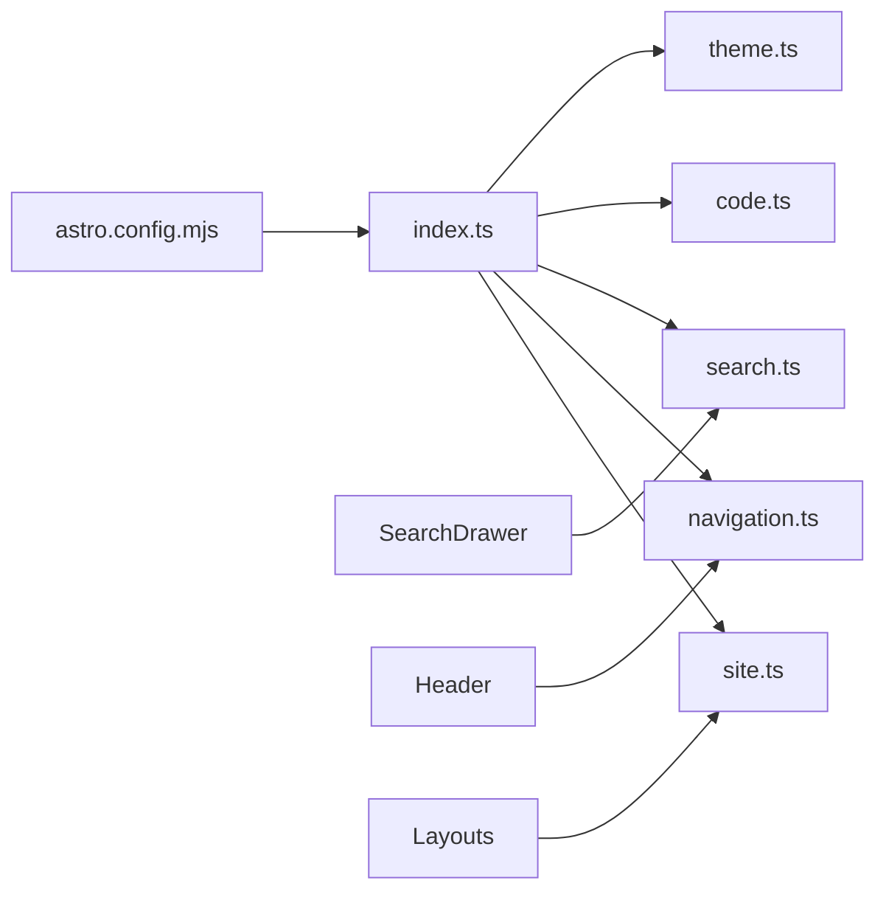

# src/config - 配置模块

## 模块概览

站点配置中心，管理站点元数据、导航、主题、搜索和代码高亮等全局配置。

## 文件清单

| 文件 | 导出符号 | 功能 |
|------|----------|------|
| `index.ts` | 统一导出 | 配置聚合入口 |
| `site.ts` | `siteConfig`, `CONTRIBUTORS_MAP`, `getRobotsContent` | 站点元数据、贡献者 |
| `navigation.ts` | `navigationConfig`, `getCurrentNavKey`, `navItems` | 顶部导航 |
| `search.ts` | `CHAPTER_LABELS` | 搜索章节映射 |
| `code.ts` | `codeConfig` | 代码高亮配置 |
| `theme.ts` | `theme` | 主题配置 |

> 2025-12-04 起，通知配置模块已移除，仅保留 Header 铃铛图标作为视觉提示。

## 核心类型

```typescript
// site.ts
interface SiteConfig {
  url: string
  title: string
  description: string
  // ...
}

interface ContributorInfo {
  name: string
  github: string
  avatar?: string
}

// navigation.ts
interface NavItem {
  key: string
  href: string
  label: string
}
```

## 配置关系图



## 修改指南

### 新增/重命名章节
当修改一级章节时，需同步以下位置：
1. `navigation.ts` - 更新 `navItems`
2. `search.ts` - `CHAPTER_LABELS` 会自动从 navigation 生成
3. `src/scripts/docsMap.ts` - 更新别名映射
4. `src/scripts/sidebars.ts` - 更新侧栏配置

### 修改站点信息
编辑 `site.ts` 中的 `siteConfig` 对象。

### 修改代码高亮
编辑 `code.ts`，配置传递给 `astro-expressive-code`。
