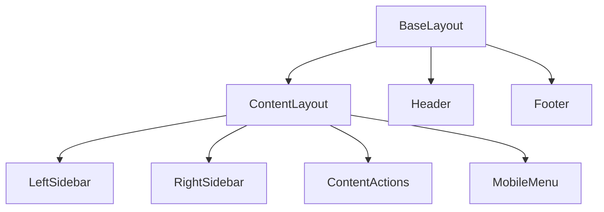

# src/layouts - 布局模块

## 模块概览

页面布局模板，定义页面的整体结构和通用元素，并负责性能优化（按需加载脚本、懒加载 KaTeX/图片）。

## 文件清单

| 文件 | 功能 |
|------|------|
| `BaseLayout.astro` | 基础 HTML 结构、SEO meta、全局样式引入 |
| `ContentLayout.astro` | 文档页三栏布局 (左侧栏 + 内容 + 右侧栏) |
| `TabContentLayout.astro` | 多标签文档布局（任意章节，支持 tab + 侧栏同步） |

## 布局层级

## BaseLayout.astro

基础布局，所有页面的根模板。

**职责**:
- HTML 文档结构 (`<html>`, `<head>`, `<body>`)
- SEO meta 标签 (title, description, og:*)
- 全局样式引入 + 主题初始化（防闪烁）
- 按需加载：KaTeX CSS（`hasMath`）、Lightbox/Spoiler/Relative-time 脚本
- Header、Footer 与主题切换脚本注入

**Props**:
- `title?`: 页面标题
- `description?`: 页面描述
- `image?`: OG 图片
- `robots?`: robots meta
- `contributors?`: 贡献者列表（写入 `<meta name="contributors">`）
- `bodyClass?`: 自定义 body class
- `hasMath?`: 是否加载 KaTeX 样式

## ContentLayout.astro

文档内容页布局，继承自 BaseLayout。

**职责**:
- 三栏布局结构
- 内容渲染 (`<slot />`)
- 侧栏组件集成（右侧 TOC / 左侧栏 / MobileMenu）
- Pagefind 索引标记 (`data-pagefind-*`，写入 chapter/author 过滤)
- 基于 `entry` 与 git 获取 `lastModified`，渲染 `ContentActions`
- 按页面 frontmatter `hasMath` 传递至 BaseLayout（KaTeX 按需加载）

**Props**:
- 继承 BaseLayout 所有 props
- `title`: 页面标题
- `entry?`: Content Collection entry（含 `filePath`、`data`）
- `headings?`: 标题列表 (用于 TOC)
- `contributors?`: 贡献者列表
- `bodyClass?`: 自定义 body class

## TabContentLayout.astro

通用多标签文档布局，支持 GitHub 风格的标签切换，适用于所有章节（concepts / daily / prompts / fun / resources / manual 等）。

**功能**:
- 自动检测同目录下的多个 .md 文件，并组织为标签页（仅匹配同目录直接子文件）
- 渲染标签切换栏 (2+ 文件时显示)，单文件目录自动退化为普通页面
- **侧栏同步**: 标签切换时自动更新 TOC（右侧目录 + Mobile TOC）和贡献者列表，并更新复制按钮 entryId
- **数学样式**: 若任意标签声明 `hasMath: true`，整体加载一次 KaTeX CSS

**Props**:
- `basePath`: 内容路径基准 (例如 `01-concepts/developer/automation`、`06-resources/preparation`)
- `title`: 页面标题（可选，默认为内容 frontmatter 中的 title）
- `sidebarItems`: 侧栏配置（通常使用对应章节的 `*_SIDEBAR`）
- `bodyClass?`: 自定义 body class

**客户端同步逻辑** (仅多标签时激活):
- 监听 `tab-changed` 事件
- 重建 TOC: 仅基于当前可见 tab panel 的标题生成目录（依赖 `/scripts/toc.js`，带 fallback）
- 更新贡献者: 根据标签元数据动态渲染贡献者列表并更新 copy 按钮 entryId

**推荐用法**:
- 二级页面：`docs/NN-*/sub/index.md` → `/alias/sub`
- 三级页面：`docs/NN-*/sub/page/index.md` → `/alias/sub/page`
- 在同一目录下添加 `details.md`、`glm.md` 等文件并配置 `tab:` frontmatter 以启用多标签

## 修改指南

1. 修改全局结构 → 编辑 `BaseLayout.astro`
2. 修改文档页结构 → 编辑 `ContentLayout.astro`
3. 修改多标签功能 → 编辑 `TabContentLayout.astro`
4. 添加新布局 → 创建新 `.astro` 文件并继承 `BaseLayout`
