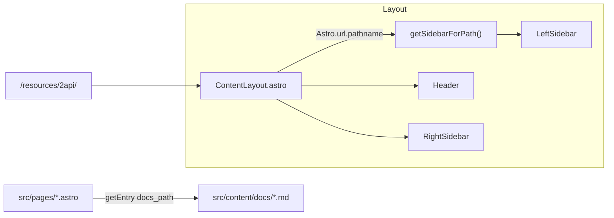

# AI Agent 通用行为指南（Fish AI Handbook 适配版）

> 目的：统一多类 AI Agent 的协作与变更准则，确保改动可审计、可复现、可回滚。
> 适用范围：本仓库内与内容、路由/侧栏、构建预览、部署相关的自动化/半自动化任务。

---

## 0. 全局原则

- 输出语言：简体中文、简洁直接，避免冗长前后缀。
- 安全合规：仅做防御性/维护性工作；不编写或优化攻击性代码；不涉及凭据发现/抓取。
- 外部链接：不生成/猜测 URL；仅使用用户提供或仓库内已存在链接。
- 工具优先级：文件操作优先使用 Glob/Grep/Read/Edit/Write；Bash 仅用于真实终端命令。
- 任务管理：全程用 TodoWrite 管理任务；同一时间仅 1 项 in_progress；完成即标记 completed。
- 文件策略：优先编辑既有文件；非明确要求不新建文件。
- 代码引用：定位时使用 `file_path:line_number` 格式。
- 命令说明：运行非平凡命令前用 1 句说明意图与影响。
- Git/PR：仅在用户明确要求时提交/推送/建 PR；遵守仓库提交规范。
- 最小输出：回答仅含完成任务所需信息。

示例片段：

```text
[说明意图] 安装依赖并构建以验证改动可通过。
[命令] npm install && npm run build
```

---

## 1. 项目上下文（来自 README）

- 技栈：Astro（`output: 'static'`）、MDX（`@astrojs/mdx`）、Shiki 代码高亮。
- 目录：
  - 内容：`src/content/docs/`
  - 路由：`src/pages/*.astro`
  - 布局：`src/layouts/`
  - 组件：`src/components/`
  - 侧栏与选择：`src/scripts/sidebars.ts`
- 常用命令：`npm install`、`npm run dev`、`npm run build`、`npm run preview`、`npm run format`、`npm run test:links`
- 内容层级：最多三级（一级/二级=文件夹+index.md；三级=单页 md）
- 命名：目录顶层 `编号-别名`；文件/路由 kebab-case；组件/脚本驼峰；不提交 `dist/`、`.astro/`

示例片段（Mermaid 架构示意，详见 README）：



---

## Mermaid 渲染实现（写作与调试）

- 写法：在 Markdown 中使用三引号并标注语言为 `mermaid`。示例：


- 渲染流程：客户端脚本 `/scripts/mermaid-init.js` 会查找 `pre[data-language="mermaid"] code`，替换为 `.mermaid` 容器，并通过 CDN 动态加载 `mermaid@10` 完成渲染。
- 主题与安全：`theme: 'dark'`、`securityLevel: 'loose'`，与站点深色样式对齐。
- 失败降级：CDN 不可达或语法错误时，保留原始代码块，确保可读。
- 本地验证：`npm run dev` 或 `npm run preview` 可查看渲染效果（需网络可访问 jsDelivr）。

---

## 2. 角色与能力矩阵

- 内容编辑 Agent
  - 允许：编辑 `src/content/docs/**`，维护 frontmatter
  - 禁止：擅自改路由/侧栏/构建配置
  - 完成：渲染正常、无死链、格式化通过
- 路由与布局 Agent
  - 允许：在 `src/pages/**` 新建/改 `.astro` 并引用 `ContentLayout`
  - 禁止：破坏全局布局与组件接口
- 完成：本地预览无 404/报错，导航高亮正常；`npm run test:links` 通过
- 侧栏维护 Agent
  - 允许：维护 `src/scripts/sidebars.ts` 的选择与 `SIDEBAR` 常量
  - 禁止：加入与路由不对应的条目
  - 完成：结构正确、链接可达
- 构建与预览 Agent
  - 允许：运行 npm 构建/预览
  - 禁止：随意改 lockfile/配置
  - 完成：`build`/`preview` 通过
- 发布 Agent
  - 允许：校对 Vercel 设置与发布参数
  - 禁止：直接操纵账号/密钥

示例片段（侧栏条目）：

```ts
// src/scripts/sidebars.ts 片段
export const PLAYGROUND_SIDEBAR = [{ label: 'Playground', href: '/playground' }]
if (path.startsWith('/playground')) return PLAYGROUND_SIDEBAR
```

---

## 3. 任务工作流与检查清单

新增“顶级章节（一级）”

1. 内容：`src/content/docs/<序号-别名>/index.md`（含 `title`）
2. 路由：`src/pages/<别名>/index.astro` 读取对应 docs entry，并包裹 `ContentLayout`
3. 侧栏：在 `src/scripts/sidebars.ts` 添加路径选择与 `SIDEBAR` 项
4. 自检：路由可达、侧栏正确、构建通过

示例片段（一级 index.astro）：

```astro
---
import ContentLayout from '../../layouts/ContentLayout.astro'
import { getEntry } from 'astro:content'
const entry = await getEntry('docs', '07-playground')
const { Content } = await entry.render()
---

<ContentLayout
  title={entry?.data?.title || 'Playground'}
  section="Playground"
  headings={[]}
>
  <Content />
</ContentLayout>
```

新增“二级 + 三级页面”

1. 内容：二级 `index.md` 与三级 `*.md`
2. 路由：`/prompts/best-practices/index.astro` 与 `/prompts/best-practices/tracing.astro`
3. 侧栏：二级 `items` 内包含三级链接
4. 自检：二/三级路由均可达

示例片段（三级 tracing.astro）：

```astro
---
import ContentLayout from '../../../layouts/ContentLayout.astro'
import { getEntry } from 'astro:content'
const entry = await getEntry('docs', '03-prompts/best-practices/tracing')
const { Content } = await entry.render()
---

<ContentLayout
  title={entry?.data?.title || 'Tracing'}
  section="提示词"
  headings={[]}
>
  <Content />
</ContentLayout>
```

实际案例：buzz页面重构（2025-10-17）

将流行词汇从单页改为多级结构：

1. 内容层：
   - `src/content/docs/01-fish-talks/buzz/index.md` - 二级主页
   - `src/content/docs/01-fish-talks/buzz/agent.md` - Agent智能体
   - `src/content/docs/01-fish-talks/buzz/vibe-coding.md` - 氛围编程
   - `src/content/docs/01-fish-talks/buzz/workflow.md` - 工作流

2. 路由层（统一模板格式）：

   ```astro
   ---
   import ContentLayout from '../../../layouts/ContentLayout.astro'
   import { FISH_TALKS_SIDEBAR } from '../../../scripts/sidebars'
   import { getEntry } from 'astro:content'

   const entry = await getEntry('docs', '01-fish-talks/buzz/agent')
   const rendered = entry && (await entry.render())
   ---

   <ContentLayout
     title={entry?.data?.title ?? 'Agent - 智能体'}
     section="鱼说必看"
     sidebarItems={FISH_TALKS_SIDEBAR}
   >
     {rendered ? <rendered.Content /> : <div>文档未找到或渲染失败</div>}
   </ContentLayout>
   ```

3. 侧栏配置：
   ```ts
   {
     label: '流行词汇',
     href: '/fish-talks/buzz',
     items: [
       { label: 'Vibe Coding', href: '/fish-talks/buzz/vibe-coding' },
       { label: 'Agent', href: '/fish-talks/buzz/agent' },
       { label: 'Workflow', href: '/fish-talks/buzz/workflow' },
     ],
   }
   ```

删除内容

- 同时删除 Markdown 与 astro 页面，并从 `sidebars.ts` 移除条目

---

## 4. 变更与提交规范

- 小步提交：聚焦“为什么”；前缀建议：`content:` / `nav:` / `layout:` / `fix:` / `build:`
- 不提交：`dist/`、`.astro/`、工具本地数据
- 仅在用户要求时使用 git/PR

示例片段（提交信息模板）：

```text
content: 新增「Playground」一级章节并接入侧栏

- 新增 docs/10-playground/index.md
- 新增 pages/playground/index.astro（ContentLayout）
- 更新 sidebars.ts：注册 PLAYGROUND_SIDEBAR 与路径选择器
```

---

## 5. 响应与沟通规范

- 默认短答：1-3 句/要点；命令前说明意图
- 不确定先澄清，最小化试错
- 执行结果透明：列出变更点与验证结论

示例片段（最小澄清）：

```text
请确认新章节排序号与别名（如 07-playground），我将据此创建内容与路由并接入侧栏。
```

---

## 5+. 面向不同 AI 的专项指南

### Warp（终端助手）

- 任务类型：代码修改、结构重构、批量路径迁移、构建验证
- 要求：
  - 修改源代码请使用补丁/编辑工具，不用临时命令直接改文件
  - 运行 npm 命令前简述意图，避免长时间阻塞；若阻塞，使用自动退出策略
  - Git 操作仅在用户授权时进行

### Claude / Claude Code

- 任务类型：内容编辑与重构、侧栏维护、文档修订
- 要求：
  - 遵循编号规范（01..06、99），禁止创建 tech/demo 顶层
  - Frontmatter 必填：title、description
  - 新建内容 → 新建路由 → 更新 sidebars → 构建验证

### Cursor

- 任务类型：多文件同步编辑、快速路径与侧栏联动修正
- 要求：
  - 发生目录改名/移动时，批量更新 getEntry 路径与 sidebars
  - 保持提交小而准，提交前本地构建

### GitHub Copilot

- 任务类型：补全建议与片段生成
- 要求：
  - 倾向给出符合仓库规范的路径与 frontmatter
  - 避免建议创建被移除的 tech/demo 结构

---

## 6. 工具与命令策略

- 文件/内容：
  - 搜索文件：Glob（如 `**/*.astro`）
  - 搜索内容：Grep（如 `getEntry\('docs'`）
  - 读写：Read/Edit/Write
- Bash：仅用于 `npm`、`git`、`gh` 等真实终端命令
- 禁止用 Bash 代替 find/grep/cat/head/tail/sed/awk/echo
- 并行：互不依赖才并行；否则顺序执行

示例片段（构建命令解释 + 执行）：

```text
说明：安装依赖并进行生产构建，验证改动可通过。
命令：npm install && npm run build
```

---

## 7. 质量门禁（Definition of Done）

- 路由与侧栏一致、无死链与 404
- 构建/预览通过，无阻断性错误
- 命名/层级/编码（UTF‑8）符合约定
- 新增内容标题、层级、侧栏展示正确
- 不产生外部未授权链接与新文件（除非授权）

示例片段（自检清单）：

```text
[ ] /playground 可访问
[ ] 左侧栏显示 Playground 并高亮
[ ] npm run build 成功
[ ] 控制台无错误
```

---

## 8. 故障与排障速查

- 404：检查侧栏路径与 `src/pages/**` 是否齐全一致
- Header 高亮错位：应基于“别名”，与中文文案脱钩
- 构建失败：优先检查对象逗号缺失、字符串误含 `\n`
- Windows 终端：确保 UTF‑8

示例片段（排障步骤）：

```text
1) 打开 src/scripts/sidebars.ts，确认 /playground 路径与 items
2) 检查 pages/playground/index.astro 是否存在
3) npm run build 观察报错定位逗号或换行问题
```

---

## 9. 部署与 SEO 约定

- Vercel：Node 20；Build: `npm run build`；Output: `dist`
- 当前策略：默认不收录。
  - BaseLayout 注入 `<meta name="robots" content="noindex, nofollow, noarchive, noimageindex">`
  - `public/robots.txt` 为 `Disallow: /`
  - `vercel.json` 仅为 `/fonts/(.*)` 添加长缓存与 CORS 头，不控制收录
- 如需允许收录：
  - 移除 BaseLayout 中的 robots meta
  - 将 `public/robots.txt` 改为允许（或删除该文件）
  - 按需在 `vercel.json` 增加/移除全站 `X-Robots-Tag` 头

示例片段（部署核对清单）：

```text
[ ] Framework: Astro（自动识别）
[ ] Install: npm install
[ ] Build: npm run build
[ ] Output: dist
[ ] Node: 20
[ ] Robots 策略符合预期（不收录/可收录）
```

---

## 10. 升级与越权处理

- 超出权限或有不确定性：停止执行 → 提出澄清 → 待授权
- 涉及依赖/配置/结构性变更：先给出影响评估与回滚方案

示例片段（影响评估模板）：

```text
变更：升级 Astro 至 vX.Y
影响：构建脚本与 MDX 解析可能变化
回滚：锁定至当前版本并还原 lockfile
```

---

## 11. 执行模板（实操）

1. 用 TodoWrite 建立 3-5 步任务，标记第 1 步为 in_progress
2. 实施并逐步完成任务，完成即标记 completed
3. 收尾：列出改动点/验证结果/下一步建议

示例片段（最小执行步骤）：

```text
- 创建 docs 与 pages 对应目录与文件
- 接入 sidebars.ts 的路径选择与 SIDEBAR
- 构建并验证无 404
```
