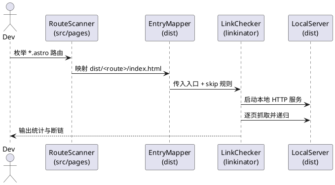

# CONTRIBUTING.md （开发维护贡献者手册）

本指南面向维护者与贡献者，统一内容结构、路由规范、提交流程与质量门禁，确保改动可审计、可复现、可回滚。

---

## 1. 协作与准则

### 1.1 与 AI 协作

- 仓库由多类 AI Agent 共建，行为边界以本文档即`CONTRIBUTING.md`为唯一事实源。
- 与 AI 协作时需在对话开头要求其严格遵循 `AGENTS.md`，并指明本文件提供流程细节。
- 决策冲突时以本文件为准，禁止绕过流程或引入额外“习惯做法”。

### 1.2 文档定位

- 说明范围：目录/层级/路由/侧栏、内容新增流程、命令校验、提交流程、CI 质量门禁。
- README.md 提供架构速览，本文负责操作细节；若两者冲突，以本文为准。

---

## 2. 信息架构规范

### 2.1 目录排序

- 顶层目录严格递增：`01-concepts`、`02-basic-usage`、`03-prompts`、`04-advanced`、`05-fun`、`06-resources`、`99-manual`（置底）。
- 不允许跳号；新增一级目录必须在末尾递增，`99-manual` 保留为固定置底。
- 历史目录 `tech`、`demo` 已废弃，其内容已并入 `06-resources`（`2API`、`云平台`）；禁止复活。

### 2.2 内容层级与 Frontmatter

- 深度最多 3 级：
  - 一级/二级：**目录 + index.md**（可继续嵌套）。
  - 三级：**单页 `.md`**，禁止“文件夹 + index.md”。
- 示范：

```text
03-prompts/
├── index.md
├── context/
│   ├── index.md           # ✓ 二级：文件夹 + index.md
│   ├── dialogue-levels.md # ✓ 三级：单页 .md
│   └── request-body.md    # ✓ 三级：单页 .md
```

```text
03-prompts/
├── context/
│   ├── dialogue-levels/
│   │   └── index.md   # ✗ 禁止三级目录
└── context.md         # ✗ 二级不得单文件
```

- 所有内容文件必须包含 frontmatter：

```yaml
---
title: 标题（必填）
description: 简短描述（必填，缺失会导致构建失败）
---
```

### 2.3 Astro 路由镜像（强制）

| 层级 | Markdown 内容                    | Astro 路由                     | 说明                         |
| ---- | -------------------------------- | ------------------------------ | ---------------------------- |
| 一级 | `<序号-别名>/index.md`           | `<别名>/index.astro`           | 章节首页                     |
| 二级 | `<序号-别名>/<子目录>/index.md`  | `<别名>/<子目录>/index.astro`  | 必须使用文件夹 + index.astro |
| 三级 | `<序号-别名>/<子目录>/<页面>.md` | `<别名>/<子目录>/<页面>.astro` | 平铺在父文件夹内             |

示例：

```text
内容：src/content/docs/99-manual/codex/index.md
路由：src/pages/manual/codex/index.astro  ✓

内容：src/content/docs/99-manual/codex/index.md
路由：src/pages/manual/codex.astro        ✗
```

### 2.4 命名规范

- 顶层目录：`NN-alias`（两位数字 + 别名）。
- 目录与文件：kebab-case（`best-practices`）。
- 组件：PascalCase；脚本：camelCase。

### 2.5 结构反模式（禁止）

- ❌ 二级直接使用 `*.md`（如 `03-prompts/best-practices.md`）。
- ❌ 三级使用“文件夹 + index.md”（如 `glossary/ai-concepts/index.md`）。
- ❌ 超过三级深度（如 `prompts/context/levels/basic/index.md`）。
- ❌ 二级路径与三级路径混用（如同时存在 `01-concepts/model-params/` 与 `01-concepts/glossary/model-params/`）。

原因：Astro `getEntry` 会容忍上述写法但会造成路径歧义、路由难以镜像，维护成本迅速失控。

---

## 3. 内容与路由操作流程

### 3.1 新增一级章节（例：`08-playground`）

- 内容：`src/content/docs/08-playground/index.md`。
- 路由：`src/pages/playground/index.astro`，通过 `getEntry('docs', '08-playground')` 读取内容。
- 导航：在 `src/config/navigation.ts` 添加 `{ key: 'playground', href: '/playground', label: '名称' }`。
- 映射：在 `src/scripts/docsMap.ts` 注册 `playground: '08-playground'`。
- 侧栏：在 `src/scripts/sidebars.ts` 为 `/playground` 定义对应条目。

### 3.2 新增二级/三级页面（以 prompts 为例）

- 内容：
  - `src/content/docs/03-prompts/best-practices/index.md`（二级）。
  - `src/content/docs/03-prompts/best-practices/tracing.md`（三级）。
- 路由：
  - `src/pages/prompts/best-practices/index.astro`（二级 **必须** 文件夹 + index.astro）。
  - `src/pages/prompts/best-practices/tracing.astro`（三级平铺）。
- 侧栏：在 `PROMPTS_SIDEBAR` 中新增对应的二级与三级链接。

### 3.3 修改或删除页面

- 修改：直接编辑对应 Markdown 与 `.astro`。
- 删除：同时移除内容文件、路由文件与 `sidebars.ts` 中的链接，避免遗留死链。

### 3.4 结构调整与迁移（强制规范）

- 禁止任何形式的重定向（`vercel.json`、`astro.config.mjs` 等不得添加 301/302/307）。
- 完全删除旧路径：同步移除 `src/content/docs/**` 与 `src/pages/**` 中的旧目录。
- 依新结构重建内容与路由，确保符合三级叶子为单页 `.md` 的硬性要求。
- 更新所有引用：侧栏、站内链接、脚本、E2E 测试等不得指向旧路径。
- 质量保证：迁移后必须手动验证路由、侧栏、测试均无 404/死链。

---

## 4. 自定义 Markdown 扩展

项目基于 `remark-directive` 扩展了 Spoiler 语法，用于隐藏敏感或剧透内容。

### 4.1 Spoiler（文本遮罩）

#### 用法

- 行内：`联系方式 :spoiler[866811662]`
- 块级容器：

```markdown
:::spoiler
这是一段被隐藏的内容
可以包含多行文本
:::
```

- 块级叶子：`::spoiler[单行隐藏内容]`

#### 渲染行为与场景

- 默认显示灰色遮罩，提示“点击查看”。
- 点击后淡入显示真实内容，支持 Tab + Enter/Space 操作。
- 适用：隐藏联系方式/邀请码、剧透、需要用户主动确认的内容。

#### 技术实现

- 语法解析：`remark-directive` + `src/plugins/remark-spoiler-directive.js`。
- 样式：`src/styles/global.css` 中 `.spoiler` 系列。
- 交互：`public/scripts/spoiler.js` 负责点击与键盘事件。

---

### 4.2 Gallery (行列图片)

#### 用法

```markdown
:::gallery{cols=2 gap=18 ratio=1/1}


:::
```
#### 渲染行为与场景

- 由参数影响 行列式，间距以及图片比例等布局样式


## 5. 开发与验证流程

### 5.1 常用命令

```bash
npm run build               # Astro 构建 + Pagefind 索引
npm run preview:search      # 构建后预览（含搜索索引），必须以非阻塞模式运行此命令
npm run test:links          # 基于 dist 的站内死链扫描
npm run lint:markdown       # 校验 Markdown 代码块
```

### 5.2 链接检测脚本工作原理

`npm run test:links` 调用 `node scripts/run-link-check.js`，自动覆盖全部路由：



关键机制：

1. **入口生成**：遍历 `src/pages/**/*.astro` 自动形成 100% 路由列表，新增/删除页面无需维护额外白名单。
2. **构建映射**：每个路由都必须在 `dist/<route>/index.html` 找到对应文件，否则脚本立即失败，避免“有路由无构建”。
3. **Linkinator 执行**：Node API 启动 linkinator，`serverRoot=dist`，并提供 `linksToSkip` 函数，仅忽略非 localhost 的 `http(s)`、`mailto:`、`tel:`，站内链接全部巡检。
4. **失败条件**：若存在 `LinkState.BROKEN` 会列出状态码/URL/父页面并返回非 0 退出码，CI 与本地流程都会被阻断。

调试：先运行 `npm run build`，再执行 `node scripts/run-link-check.js --trace-warnings` 查看入口数与扫描统计。

### 5.3 必跑校验

在进行单markdown文件之外的变动和修改后，**必须按照如下流程进行check**：

- `npm run format`
- `npm run build`
- `npm run lint:markdown`
- `npm run preview:search`（含搜索索引的预览，调用时必须以非阻塞形式运行）
- `npm run test:links`
- `npm run type-check`
- `npm run check:routes`
- `npm run test:e2e`（如涉及 E2E 场景变更必须新增/更新用例）

### 5.4 命令说明（关键两项）

- `npm run check:routes`：验证一级/二级/三级内容与路由的镜像关系；禁止二级平铺 `.astro`、禁止三级“文件夹 + index”。若不一致将返回非 0 并定位到缺失/多余/非法路径。
- `npm run type-check`：基于 `astro check`，覆盖 `.astro` + TS/JS + Content Collections，要求 `0 errors / 0 warnings`。Hints（如 `is:inline`）为信息提示，可忽略。

---

## 6. Git 工作流与提交规范

### 6.1 Commit Message 规范

项目遵循 **Conventional Commits**，使用英文描述，常见类型：

- `init` 初始化
- `release` 发布新版本
- `style` 代码格式更改
- `feat` 新功能
- `ui/ux` 视觉或交互调整
- `fix` bug 修复
- `docs` 维护开发文档
- `content` 更改网站正文内容
- `refactor` 结构重构
- `perf` 性能优化
- `dx` 开发体验改进
- `workflow` 工作流/CI 变更
- `types` 类型声明
- `wip` 进行中的工作（需用户指定）
- `test` 测试用例
- `build` 构建/依赖相关
- `chore` 其它非源码改动
- `deps` 依赖升级/回退

格式：

```
[type][optional scope]: [description in English]

[optional body]

[optional footer]
```

规则：

- 主题可用英文或中文，长度不超过 72 字符，使用祈使句（`add` 而非 `added`），末尾不加句号。
- 主题与正文之间空一行；正文描述 What/Why 而非 How。
- 若提交存在破坏性变更，在 type 后追加 `!`，并在正文末尾使用 `BREAKING CHANGE:` 说明。
- 每行首字母必须是小写

### 6.2 Scope 使用

- **单模块改动**必须指定 scope，例如：
  - `feat(search): add keyboard shortcuts`
  - `fix(sidebar): resolve collapse animation`
  - `content(prompts): add advanced examples`
- **跨模块/全局改动**不加 scope，如 `refactor: restructure entire content hierarchy`。
- **Merge commits** 统一用 `chore:`，不带 scope。
- 常见 scope：`search`、`sidebar`、`header`、`footer`、`toc`、`prompts`、`manual`、`resources`、`glossary`、`routing`、`navigation`、`ui`、`style`、`seo`、`deps`、`build`、`ci`、`config`。

### 6.3 多类型提交

- 若主题同时符合多个类型，用 `+` 连接（不超过 3 个），如 `docs+fix:`。
- 仅当两个类型同等重要时才使用 `+`；如果只是顺手更新文档，不算多类型。

### 6.4 提交示例

heading + body：

```
feat(sidebar): add sidebar collapse functionality

enhance user experience by adding sidebar collapse/expand
interaction with state persistence.
- use localStorage to persist collapse state
- add smooth expand/collapse animation
```

heading + footer：

```
fix: resolve mobile navigation menu click issue

navigation menu items fail to redirect correctly on small
screen devices. The issue was caused by prevented event
bubbling and has been fixed.
```

heading + body + footer ：

```
docs+dx: improve contribution guide and dev scripts

- add commit message conventions to CONTRIBUTING.md
- optimize npm scripts with new check:routes command

remarks: old docs and workflow are out of date badly, the user
manually rewrites the docs.
```

### 6.5 分支与工作流

- 保护分支：`main` 禁止直接提交，仅限管理员 push。
- 新建分支：基于远程 `main` 创建并切换，如 `git fetch origin && git checkout -b feature/<短描述> origin/main`。
- 推送：本地小步提交，推送到远程同名分支。
- 合并：一律通过 PR 合入 `main`，禁止本地直接合并。
- 合并前：至少确保 `npm run build` 与 `npm run test:links` 通过。

### 6.6 CI 校验（PR 自动执行）

- 触发条件：向 `main` 或 `master` 创建 PR。
- 自动校验：
  - 路由结构：`node scripts/check-route-structure.js`（等价 `npm run check:routes`）。
  - 类型检查：`astro check`（等价 `npm run type-check`）。
- 任一失败将阻止合并。建议本地先跑上述命令再提交。
- AI/Copilot Review 属建议性检查；CI 属强制门禁；人工 Review 在 CI 通过后进行。

---

## 7. 变更登记与 PR 检查

### 7.1 变更登记与交叉维护

- PR 描述需覆盖 Why/What/How，并附上验证结果摘要。
- 变更同时更新相关引用：`README.md`、`AGENTS.md`、`CONTRIBUTING.md`、`WARP/CLAUDE/CURSOR.md` 等。

### 7.2 PR 检查清单（参考 `.github/PULL_REQUEST_TEMPLATE.md`）

- 顶层目录是否遵循 `01..06`、`99` 的顺序且无跳号。
- 新增页面是否包含必填 frontmatter `title`、`description`。
- 路由 `.astro` 是否与内容路径一致（含 `getEntry` 调用）。
- 侧栏与导航是否同步更新。
- 构建是否通过、无 404/死链。

---

## 8. 常见问题

- 构建报错缺少 description：补充该文档的 frontmatter `description`。
- 页面 404：确认内容文件、路由文件、侧栏条目是否一一对应。
- Header 高亮错位：依据“别名”匹配，与中文标题无关，检查路由前缀。

---
