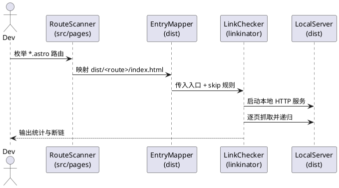

# CONTRIBUTING.md （开发维护贡献者手册）

本指南面向维护者与贡献者，统一内容结构、路由规范、提交流程与质量门禁，确保改动可审计、可复现、可回滚。

---

## 1. 协作与准则

### 1.1 与 AI 协作

- 仓库由多类 AI Agent 共建，行为边界以本文档即`CONTRIBUTING.md`为唯一事实源。
- 与 AI 协作时需在对话开头要求其严格遵循 `AGENTS.md`，并指明本文件提供流程细节。
- 决策冲突时以本文件为准，禁止绕过流程或引入额外“习惯做法”。

### 1.2 文档定位

- 说明范围：目录/层级/路由/侧栏、内容新增流程、命令校验、提交流程、CI 质量门禁。
- README.md 提供架构速览，本文负责操作细节；若两者冲突，以本文为准。

---

## 2. 信息架构规范

### 2.1 目录排序

- 顶层目录严格递增：`01-concepts`、`02-daily`、`03-prompts`、`04-advanced`、`05-fun`、`06-resources`、`07-theoretical`、`99-manual`（置底）。
- 不允许跳号；新增一级目录必须在末尾递增，`99-manual` 保留为固定置底。

### 2.2 内容层级与 Frontmatter

- 深度最多 3 级：
  - 一级：`docs/<NN-alias>/index.md`（文件夹 + index.md，章节首页）
  - 二级：`docs/<NN-alias>/<sub>/index.md`（文件夹 + index.md，子章节首页）
  - 三级：`docs/<NN-alias>/<sub>/<page>/index.md`（文件夹 + index.md，叶子页面）
    - 同一 2/3 级目录下额外的 `*.md`（如 `details.md`、`glm.md`）作为**标签文件**，由多标签系统渲染
- 示范：

```text
03-prompts/
├── index.md                        # 一级
├── context/
│   ├── index.md                    # 二级
│   ├── details.md                    # 二级对应的tab
│   └── glossary/
│       └── index.md                # 三级
```

```text
03-prompts/
├── context/
│   ├── index.md
│   └── dialogue-levels.md          # ✗ 三级不得单文件，应为 dialogue-levels/index.md
└── context.md                      # ✗ 二级不得单文件，应为 context/index.md
```

- 所有内容文件必须包含 frontmatter：

```yaml
---
title: 标题（必填）
description: 简短描述（必填，缺失会导致构建失败）
---
```

### 2.3 Astro 路由镜像（强制）

| 层级 | Markdown 内容                             | Astro 路由                            | 说明                         |
| ---- | ----------------------------------------- | ------------------------------------- | ---------------------------- |
| 一级 | `<序号-别名>/index.md`                    | `<别名>/index.astro`                  | 章节首页                     |
| 二级 | `<序号-别名>/<子目录>/index.md`           | `<别名>/<子目录>/index.astro`         | 必须使用文件夹 + index.astro |
| 三级 | `<序号-别名>/<子目录>/<页面>/index.md`    | `<别名>/<子目录>/<页面>/index.astro`  | 叶子页面（目录 + index.md） |

示例：

```text
内容：src/content/docs/99-manual/codex/index.md
路由：src/pages/manual/codex/index.astro  ✓

内容：src/content/docs/99-manual/codex/index.md
路由：src/pages/manual/codex.astro        ✗
```

### 2.4 命名规范

- 顶层目录：`NN-alias`（两位数字 + 别名）。
- 目录与文件：kebab-case（`best-practices`）。
- 组件：PascalCase；脚本：camelCase。

### 2.5 结构反模式（禁止）

- ❌ 二级直接使用 `*.md`（如 `03-prompts/best-practices.md`）。
- ❌ 三级直接使用单文件 `.md`（如 `glossary/ai-concepts.md`，应为 `glossary/ai-concepts/index.md`）。
- ❌ 超过三级深度（如 `prompts/context/levels/basic/index.md`）。
- ❌ 二级路径与三级路径混用（如同时存在 `01-concepts/model-params/` 与 `01-concepts/glossary/model-params/`）。

原因：Astro `getEntry` 会容忍上述写法但会造成路径歧义、路由难以镜像，维护成本迅速失控。

---

## 3. 内容与路由操作流程

### 3.1 新增一级章节（例：`08-playground`）

- 内容：`src/content/docs/08-playground/index.md`。
- 路由：`src/pages/playground/index.astro`，通过 `getEntry('docs', '08-playground')` 读取内容。
- 导航：在 `src/config/navigation.ts` 添加 `{ key: 'playground', href: '/playground', label: '名称' }`。
- 映射：在 `src/scripts/docsMap.ts` 注册 `playground: '08-playground'`。
- 侧栏：在 `src/scripts/sidebars.ts` 为 `/playground` 定义对应条目。

### 3.2 新增二级/三级页面（以 prompts 为例）

- 内容：
  - `src/content/docs/03-prompts/best-practices/index.md`（二级）。
  - `src/content/docs/03-prompts/best-practices/tracing/index.md`（三级，目录 + index.md）。
- 路由：
  - `src/pages/prompts/best-practices/index.astro`（二级 **必须** 文件夹 + index.astro）。
  - `src/pages/prompts/best-practices/tracing/index.astro`（三级 **必须** 文件夹 + index.astro）。
- 侧栏：在 `PROMPTS_SIDEBAR` 中新增对应的二级与三级链接。

### 3.3 修改或删除页面

- 修改：直接编辑对应 Markdown 与 `.astro`。
- 删除：同时移除内容文件、路由文件与 `sidebars.ts` 中的链接，避免遗留死链。

### 3.4 结构调整与迁移（强制规范）

- 禁止任何形式的重定向（`vercel.json`、`astro.config.mjs` 等不得添加 301/302/307）。
- 完全删除旧路径：同步移除 `src/content/docs/**` 与 `src/pages/**` 中的旧目录。
- 依新结构重建内容与路由，确保符合三级叶子为“目录 + index.md”的硬性要求。
- 更新所有引用：侧栏、站内链接、脚本、E2E 测试等不得指向旧路径。
- 质量保证：迁移后必须手动验证路由、侧栏、测试均无 404/死链。

---

## 4. 自定义 Markdown 扩展

项目基于 `remark-directive` 扩展了 Spoiler 语法，用于隐藏敏感或剧透内容。

### 4.1 Spoiler（文本遮罩）

#### 用法

- 行内：`联系方式 :spoiler[866811662]`
- 块级容器：

```markdown
:::spoiler
这是一段被隐藏的内容
可以包含多行文本
:::
```

- 块级叶子：`::spoiler[单行隐藏内容]`

#### 渲染行为与场景

- 默认显示灰色遮罩，提示“点击查看”。
- 点击后淡入显示真实内容，支持 Tab + Enter/Space 操作。
- 适用：隐藏联系方式/邀请码、剧透、需要用户主动确认的内容。

#### 技术实现

- 语法解析：`remark-directive` + `src/plugins/remark-spoiler-directive.js`。
- 样式：`src/styles/global.css` 中 `.spoiler` 系列。
- 交互：`public/scripts/spoiler.js` 负责点击与键盘事件。

---

### 4.2 Gallery (行列图片)

#### 用法

基础语法：`:::gallery{参数}` + 图片列表 + `:::`

```markdown
:::gallery{cols=2 gap=18 ratio=1/1}


:::
```

#### 参数说明

| 参数 | 类型 | 默认值 | 说明 |
|------|------|--------|------|
| `cols` | number | `2` | 列数，图片按此列数自动换行 |
| `gap` | number/string | `12px` | 图片间距，纯数字自动补 `px`，支持 `rem`、`%` 等单位 |
| `ratio` | string | `auto` | 图片宽高比，如 `1/1`（正方形）、`16/9`（横屏）、`4/3` |

#### 示例

- **2 列正方形网格**（常用于头像/图标展示）：

```markdown
:::gallery{cols=2 gap=18 ratio=1/1}


:::
```

- **6 列紧凑网格**（适合小图标/表情包）：

```markdown
:::gallery{cols=6 gap=5 ratio=1/1}


:::
```

- **3 列自适应高度**（保持原图比例）：

```markdown
:::gallery{cols=3 gap=1rem}


:::
```

#### 渲染行为与场景

- 自动提取容器内所有图片，每张图片独立占一格（避免多图被 `<p>` 包裹导致只占一格）。
- 图片自动添加 `loading="lazy"` 懒加载属性。
- 图片使用 `object-fit: cover` 填充，配合 `ratio` 可实现统一裁切效果。
- 适用场景：作品展示、表情包集合、对比图、截图集锦等。

#### 技术实现

- 语法解析：`remark-directive` + `src/plugins/remark-gallery-directive.js`。
- 样式：`src/styles/global.css` 中 `.image-gallery` 与 `.image-gallery__item` 系列。
- CSS Grid 布局，通过 CSS 变量 `--gallery-cols`、`--gallery-gap`、`--gallery-ratio` 控制。

---

### 4.3 Mark（颜色标记）

#### 用法

- 行内：`:mark[要标记的文字]{c=颜色名}`
- 块级容器：

```markdown
:::mark{c=blue}
这是一段带颜色的内容
可以包含多行文本
:::
```

- 块级叶子：`::mark[单行标记内容]{c=green}`

#### 参数说明

| 参数 | 类型 | 默认值 | 说明 |
|------|------|--------|------|
| `c` / `color` | string | `default` | 颜色名称或 CSS 颜色值 |

#### 预定义颜色

设计原则：纯文字颜色变化，无背景，与段落行为一致。

| 颜色名 | 效果说明 |
|--------|----------|
| `red` | 珊瑚红，适用于警告、错误、重要提示 |
| `orange` | 琥珀色，适用于注意事项 |
| `yellow` | 金色，适用于高亮、提醒 |
| `green` | 薄荷绿，适用于成功、正确、推荐 |
| `cyan` | 青蓝色，适用于技术术语、代码相关 |
| `blue` | 科技蓝（与主题协调），适用于信息、链接、引用 |
| `purple` | 薰衣草紫，适用于特殊、高级功能 |
| `pink` | 玫瑰粉，适用于装饰、趣味内容 |
| `gray` | 中性灰，适用于次要信息、注释 |
| `white` | 纯白色，适用于强调关键词 |

#### 示例

- **行内标记**：

```markdown
这是一段包含 :mark[重要内容]{c=red} 的文字。
你也可以使用 :mark[提示信息]{c=yellow} 来高亮。
```

- **自定义颜色**（支持 CSS 颜色值）：

```markdown
:mark[自定义颜色]{c=#ff6b6b}
:mark[RGB 颜色]{c=rgb(100,200,150)}
```

- **块级标记**：

```markdown
:::mark{c=blue}
这是一段需要特别注意的内容块。
支持多行文本和其他 Markdown 语法。
:::
```

#### 渲染行为与场景

- 行内标记渲染为 `<span class="mark">` 元素，仅改变文字颜色。
- 块级标记渲染为 `<div class="mark mark-block">` 元素。
- 标记文字与段落中普通文字行为完全一致，无额外背景或边距。
- 预定义颜色使用 `data-color` 属性匹配样式。
- 自定义颜色通过 CSS 变量 `--mark-color` 传递。
- 适用：强调关键词、标注状态、分类标签等。

#### 技术实现

- 语法解析：`remark-directive` + `src/plugins/remark-mark-directive.js`。
- 样式：`src/styles/global.css` 中 `.mark[data-color]` 系列。
- 颜色通过 `data-color` 属性或 CSS 变量控制。

---

### 4.4 Multi-Tab Content（多标签内容切换）

> **适用范围：** 所有章节（concepts / daily / prompts / fun / resources / manual 等）

本系统允许在同一 URL 下切换显示多个内容变体，类似 GitHub 的 README/CONTRIBUTING 切换器。

#### 与传统三级页面的区别

| 特性 | 传统三级页面（URL 跳转） | 多标签内容（同 URL 切换） |
|------|------------------------|------------------------|
| URL | 每个子页面独立 URL | 同一 URL，内容切换 |
| 侧边栏 | 展开显示子项 | 不展开，标签在内容区 |
| TOC/贡献者 | 固定为当前页 | 随标签切换动态更新 |
| 适用场景 | 内容独立，需单独索引/分享 | 内容紧密相关，快速对比切换 |

#### 目录结构

```text
02-daily/claude-code/basics/
├── index.md        # [Overview] 默认标签（必须）
├── details.md      # [Details] 详情标签（可选）
├── glm.md          # [GLM] 额外标签（可选）
└── ...             # 可任意扩展更多标签
```

- **单文件目录**（仅有 `index.md`）：自动退化为普通页面，无标签栏
- **多文件目录**：自动显示标签切换栏

#### Frontmatter 配置

非 `index.md` 的标签文件必须包含 `tab` 字段：

```yaml
---
title: API Key - Details
description: 详细配置指南
tab:
  label: Details      # 标签显示名（可选，默认用文件名首字母大写）
  order: 10           # 排序权重（可选，index=0, details=10, 其他=20+）
---
```

#### 默认标签排序

| 文件名 | 默认 order | 默认 label |
|---------|-------------|-------------|
| `index.md` | 0 | Overview |
| `details.md` | 10 | Details |
| `examples.md` | 20 | Examples |
| `changelog.md` | 30 | Changelog |
| 其他 | 100+ | 文件名首字母大写 |

#### 路由规则

- 标签内容文件（带 `tab:` frontmatter）**不需要**单独的 `.astro` 路由文件
- 它们通过父级 `index.astro` 渲染，`check:routes` 脚本会自动跳过这些文件
- 这是对「2.3 Astro 路由镜像」的一处特例：带 `tab:` 的标签文件由父级路由统一承载，无需为每个标签创建单独路由

#### 技术实现

- Schema 扩展：`src/content/config.ts` 中的 `tabSchema`
- 工具函数：`src/utils/tabContent.ts`（`organizeTabEntries` 仅匹配直接子文件，避免章节根目录误匹配所有子目录）
- 标签组件：`src/components/ContentTabSwitcher.astro`
- 布局组件：`src/layouts/TabContentLayout.astro`
- TOC 脚本：`public/scripts/toc.js`（桌面/移动端共用）

#### 响应式行为

- **桌面端 TOC**（`.toc-nav`）：由 `TabContentLayout` 在页面加载和标签切换时动态重建
- **移动端 TOC**（`.mobile-toc-nav`）：同样由 `TabContentLayout` 管理，与桌面端保持同步
- **关键逻辑**：`MobileMenu.astro` 检测到页面有 `.content-tab-panel` 时，跳过自动初始化 TOC，交由 `TabContentLayout` 统一管理
- **切换时更新**：标签切换触发 `tab-changed` 事件，`TabContentLayout` 监听后重建两端 TOC，仅显示当前激活标签的标题

#### SEO 与 RSS 设计哲学

- **Sitemap**：由 `@astrojs/sitemap` 基于实际路由生成，标签文件没有单独路由，因此不会出现在 sitemap 中，这是正确的行为
- **RSS**：`src/pages/rss.xml.ts` 生成时会过滤带 `tab:` frontmatter 的文件，避免生成 404 链接
- **爬虫索引**：所有标签内容均已在 HTML 中渲染（通过 `hidden` 属性隐藏非默认标签），爬虫可索引全部内容
- **设计原理**：标签内容是同一页面的另一个视图，而非独立页面；用户通过客户端 Tab 切换浏览，而非 URL 跳转

## 5. 开发与验证流程

### 5.1 常用命令

```bash
# 封装命令（推荐，输出简洁）
npm run check:page-structure  # 页面结构检查：build → check:routes → test:links
npm run check:all             # 全量检查：format → build → type-check → check:routes → test:links

# 单项命令
npm run build               # Astro 构建 + Pagefind 索引
npm run preview:search      # 构建后预览（含搜索索引），必须以非阻塞模式运行此命令
npm run test:links          # 基于 dist 的站内死链扫描
npm run lint:markdown       # 校验 Markdown 代码块
```

### 5.2 链接检测脚本工作原理

`npm run test:links` 调用 `node scripts/run-link-check.js`，自动覆盖全部路由：



关键机制：

1. **入口生成**：遍历 `src/pages/**/*.astro` 自动形成 100% 路由列表，新增/删除页面无需维护额外白名单。
2. **构建映射**：每个路由都必须在 `dist/<route>/index.html` 找到对应文件，否则脚本立即失败，避免“有路由无构建”。
3. **Linkinator 执行**：Node API 启动 linkinator，`serverRoot=dist`，并提供 `linksToSkip` 函数，仅忽略非 localhost 的 `http(s)`、`mailto:`、`tel:`，站内链接全部巡检。
4. **失败条件**：若存在 `LinkState.BROKEN` 会列出状态码/URL/父页面并返回非 0 退出码，CI 与本地流程都会被阻断。

调试：先运行 `npm run build`，再执行 `node scripts/run-link-check.js --trace-warnings` 查看入口数与扫描统计。

### 5.3 必跑校验

在进行单markdown文件之外的变动和修改后，**推荐使用封装命令**：

| 场景 | 推荐命令 | 说明 |
|------|----------|------|
| 页面结构变更（增删改页面） | `npm run check:page-structure` | build → check:routes → test:links |
| 提交前全量检查 | `npm run check:all` | format → build → type-check → check:routes → test:links |
| E2E 场景变更 | `npm run test:e2e` | 需单独运行 |

封装命令特点：
- 成功时只显示 `✓ 任务名`，失败时只显示错误信息
- 任一步骤失败立即停止，便于快速定位问题

<details>
<summary>单项命令（按执行顺序）</summary>

1. `npm run format`
2. `npm run build`
3. `npm run type-check`
4. `npm run check:routes`
5. `npm run test:links`
6. `npm run lint:markdown`
7. `npm run preview:search`（含搜索索引的预览，调用时必须以非阻塞形式运行）
8. `npm run test:e2e`（如涉及 E2E 场景变更必须新增/更新用例）

</details>

### 5.4 命令说明（关键两项）

- `npm run check:routes`：验证一级/二级/三级内容与路由的镜像关系；禁止二级平铺 `.astro`、禁止三级单文件 `.md`（要求“目录 + index.md”），并自动忽略带 `tab:` 的标签文件。若不一致将返回非 0 并定位到缺失/多余/非法路径。
- `npm run type-check`：基于 `astro check`，覆盖 `.astro` + TS/JS + Content Collections，要求 `0 errors / 0 warnings`。Hints（如 `is:inline`）为信息提示，可忽略。

---

## 6. Git 工作流与提交规范

### 6.1 Commit Message 规范

项目遵循 **Conventional Commits**，使用英文描述，常见类型：

- `init` 初始化
- `release` 发布新版本
- `style` 代码格式更改
- `feat` 新功能
- `ui/ux` 视觉或交互调整
- `fix` bug 修复
- `docs` 维护开发文档
- `content` 更改网站正文内容
- `refactor` 结构重构
- `perf` 性能优化
- `dx` 开发体验改进
- `workflow` 工作流/CI 变更
- `types` 类型声明
- `wip` 进行中的工作（需用户指定）
- `test` 测试用例
- `build` 构建/依赖相关
- `chore` 其它非源码改动
- `deps` 依赖升级/回退

格式：

```
[type][optional scope]: [description in English]

[optional body]

[optional footer]
```

规则：

- 主题可用英文或中文，长度不超过 72 字符，使用祈使句（`add` 而非 `added`），末尾不加句号。
- 主题与正文之间空一行；正文描述 What/Why 而非 How。
- 若提交存在破坏性变更，在 type 后追加 `!`，并在正文末尾使用 `BREAKING CHANGE:` 说明。
- 每行首字母必须是小写

### 6.2 Scope 使用

- **单模块改动**必须指定 scope，例如：
  - `feat(search): add keyboard shortcuts`
  - `fix(sidebar): resolve collapse animation`
  - `content(prompts): add advanced examples`
- **跨模块/全局改动**不加 scope，如 `refactor: restructure entire content hierarchy`。
- **Merge commits** 统一用 `chore:`，不带 scope。
- 常见 scope：`search`、`sidebar`、`header`、`footer`、`toc`、`prompts`、`manual`、`resources`、`glossary`、`routing`、`navigation`、`ui`、`style`、`seo`、`deps`、`build`、`ci`、`config`。

### 6.3 多类型提交

- 若主题同时符合多个类型，用 `+` 连接（不超过 3 个），如 `docs+fix:`。
- 仅当两个类型同等重要时才使用 `+`；如果只是顺手更新文档，不算多类型。

### 6.4 提交示例

heading + body：

```
feat(sidebar): add sidebar collapse functionality

enhance user experience by adding sidebar collapse/expand
interaction with state persistence.
- use localStorage to persist collapse state
- add smooth expand/collapse animation
```

heading + footer：

```
fix: resolve mobile navigation menu click issue

navigation menu items fail to redirect correctly on small
screen devices. The issue was caused by prevented event
bubbling and has been fixed.
```

heading + body + footer ：

```
docs+dx: improve contribution guide and dev scripts

- add commit message conventions to CONTRIBUTING.md
- optimize npm scripts with new check:routes command

remarks: old docs and workflow are out of date badly, the user
manually rewrites the docs.
```

### 6.5 分支与工作流

- 保护分支：`main` 禁止直接提交，仅限管理员 push。
- 新建分支：基于远程 `main` 创建并切换，如 `git fetch origin && git checkout -b feature/<短描述> origin/main`。
- 推送：本地小步提交，推送到远程同名分支。
- 合并：一律通过 PR 合入 `main`，禁止本地直接合并。
- 合并前：至少确保 `npm run build` 与 `npm run test:links` 通过。

### 6.6 CI 校验（PR 自动执行）

- 触发条件：向 `main` 或 `master` 创建 PR。
- 自动校验：
  - 路由结构：`node scripts/check-route-structure.js`（等价 `npm run check:routes`）。
  - 类型检查：`astro check`（等价 `npm run type-check`）。
- 任一失败将阻止合并。建议本地先跑上述命令再提交。
- AI/Copilot Review 属建议性检查；CI 属强制门禁；人工 Review 在 CI 通过后进行。

---

## 7. 变更登记与 PR 检查

### 7.1 变更登记与交叉维护

- PR 描述需覆盖 Why/What/How，并附上验证结果摘要。
- 变更同时更新相关引用：`README.md`、`AGENTS.md`、`CONTRIBUTING.md`、`WARP/CLAUDE/CURSOR.md` 等。

### 7.2 PR 检查清单（参考 `.github/PULL_REQUEST_TEMPLATE.md`）

- 顶层目录是否遵循 `01..06`、`99` 的顺序且无跳号。
- 新增页面是否包含必填 frontmatter `title`、`description`。
- 路由 `.astro` 是否与内容路径一致（含 `getEntry` 调用）。
- 侧栏与导航是否同步更新。
- 构建是否通过、无 404/死链。

---

## 8. 搜索功能维护

项目使用 Pagefind 实现站内搜索，支持 `chapter:` 和 `author:` 过滤语法。

### 8.1 搜索过滤器工作原理

- **chapter 过滤器**：基于 URL 路径的第一段（如 `/prompts/xxx` → `chapter:prompts`）
- **author 过滤器**：基于页面 contributors，优先取非 Fish 的第一个贡献者
- **索引位置**：`src/layouts/ContentLayout.astro` 中通过 `data-pagefind-filter` 属性输出

### 8.2 章节重命名同步清单

当新增、删除或重命名一级章节（如 `03-prompts` → `03-techniques`）时，**必须同步以下位置**：

1. **SearchDrawer 章节映射**（`src/components/SearchDrawer.astro`）：
   ```javascript
   // 服务端脚本（frontmatter）- 序列化为 JSON 字符串
   import { CHAPTER_LABELS as SHARED_CHAPTER_LABELS } from '../config'
   const chapterLabelsJson = JSON.stringify(SHARED_CHAPTER_LABELS)

   // HTML 模板 - 通过 data 属性传递
   <div id="search-drawer" data-chapter-labels={chapterLabelsJson}>

   // 客户端脚本（<script is:inline> 块内）- 从 data 属性读取
   const drawer = document.getElementById('search-drawer')
   const CHAPTER_LABELS = JSON.parse(drawer?.dataset.chapterLabels || '{}')
   ```
   - **重要**：Astro 的 `<script is:inline>` 不会插值 frontmatter 变量，必须通过 `data-*` 属性传递数据到客户端。
   - 数据源在 `src/config/search.ts`，由 `navigationConfig.items` 动态生成，**不要在组件内手写映射**。
   - 如需新增/重命名章节，优先修改 `src/config/navigation.ts`，映射会自动同步。

2. **docsMap 映射**（`src/scripts/docsMap.ts`）：确保别名与内容目录对应

3. **navigation 导航**（`src/config/navigation.ts`）：更新导航链接

4. **sidebars 侧栏**（`src/scripts/sidebars.ts`）：更新侧栏条目

### 8.3 重建搜索索引

任何内容结构变更后，必须重新构建以更新 Pagefind 索引：

```bash
npm run build  # 重新构建，会自动生成新的 Pagefind 索引
```

### 8.4 特殊值说明

- `chapter:all`：等同于不加 chapter 过滤，搜索全部章节
- 首页等非章节页面会显示 `chapter:all` 提示

---

## 9. 常见问题

- 构建报错缺少 description：补充该文档的 frontmatter `description`。
- 页面 404：确认内容文件、路由文件、侧栏条目是否一一对应。
- Header 高亮错位：依据"别名"匹配，与中文标题无关，检查路由前缀。
- Header 铃铛：通知 Popover 模块已下线，铃铛仅保留静态图标，请勿重新引入 `notifications.ts` 或相关脚本。
- 搜索无结果：确认已运行 `npm run build` 生成 Pagefind 索引；检查 `CHAPTER_LABELS` 映射是否与实际路径一致。

---
