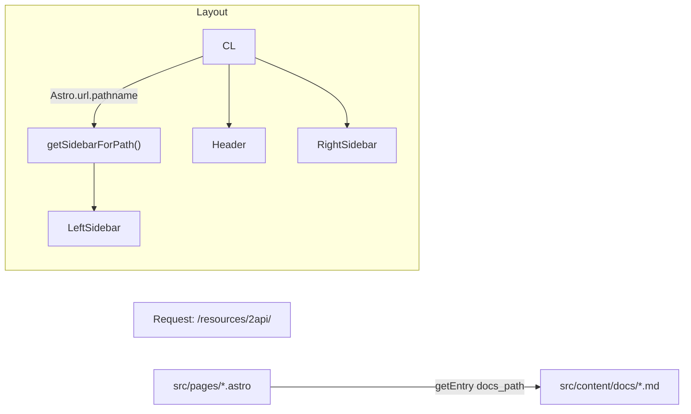

# Fish AI Handbook（维护者维护手册）

本项目由我借助 AI 建立与维护，README 仅面向“未来的我”。目标：能在数分钟内回忆技术栈和原理，并按步骤完成新增/修改/删除与部署。

协作入口（快速访问）
- 开发协作规范：CONTRIBUTING.md
- AI 协作指南：AI_AGENT_GUIDE.md
- Warp 专用指南：WARP.md
- PR 模板：.github/PULL_REQUEST_TEMPLATE.md
- Issue 模板：.github/ISSUE_TEMPLATE/

## 目录（快速跳转）
<a id="toc"></a>
- [技术架构说明](#overview)
- [内容管理指南（含 1/2/3 级页面完整示例）](#contrib)
- [开发维护流程](#maintenance)
- [最佳实践与项目内约定](#rules)
- [Vercel 部署指南](#vercel)

## 1) 技术架构说明

> 目录与排序（当前规范）
> - 顶层严格递增：01-fish-talks、02-basic-usage、03-prompts、04-advanced-techniques、05-fun、06-resources、99-setup（置底）
> - 不允许跳号；新增一级目录按顺序加 1；Setup 固定 99
> - “技术向/DEMO”已移除；原“技术向”内容已合并为“资源合集”的 2API 与 云平台 两个二级页面
<a id="overview"></a> [回到目录](#toc)

- 核心技术栈
  - Astro 静态站点（`output: 'static'`）；MDX：`@astrojs/mdx`；代码高亮：Shiki。
- 目录结构（关键）
  - `src/pages/` 路由（.astro）；`src/content/docs/` 内容（Markdown）。
  - `src/layouts/` 布局；`src/components/` 通用组件；`src/scripts/sidebars.ts` 左侧栏清单与选择逻辑。
- 组件与数据流原理（示意）



## 2) 内容管理指南（含 1/2/3 级示例）
<a id="contrib"></a> [回到目录](#toc)

规则：最多三级。一级/二级 = “文件夹 + index.md”；三级 = 单个 `.md`。

- 新增“顶级章节（一级）”示例：新增 `playground`（假设排序号 07）
  1. 内容：`src/content/docs/07-playground/index.md`
     ```markdown
     ---
     title: Playground
     ---
     # Playground 概览
     ```
  2. 路由：`src/pages/playground/index.astro`
     ```astro
     ---
     import ContentLayout from '../../layouts/ContentLayout.astro'
     import { getEntry } from 'astro:content'
const entry = await getEntry('docs','07-playground')
     const { Content } = await entry.render()
     ---
     <ContentLayout title={entry?.data?.title || 'Playground'} section="Playground" headings={[]}>
       <Content />
     </ContentLayout>
     ```
  3. 侧栏：在 `src/scripts/sidebars.ts` 的选择器与对应 `SIDEBAR` 中按你需要添加：
     ```ts
     if (path.startsWith('/playground')) return PLAYGROUND_SIDEBAR
     export const PLAYGROUND_SIDEBAR=[{ label:'Playground', href:'/playground' }]
     ```

- 新增“二级 + 三级页面”示例：在 `03-prompts` 下新增二级 `best-practices`，以及三级 `tracing.md`
  1. 内容层：
     - `src/content/docs/03-prompts/best-practices/index.md`
     - `src/content/docs/03-prompts/best-practices/tracing.md`
  2. 路由层：
     - `src/pages/prompts/best-practices/index.astro` 读取二级 index
     - `src/pages/prompts/best-practices/tracing.astro` 读取三级 md
     ```astro
     ---
     import ContentLayout from '../../../layouts/ContentLayout.astro'
     import { getEntry } from 'astro:content'
     const entry = await getEntry('docs','03-prompts/best-practices')
     const { Content } = await entry.render()
     ---
     <ContentLayout title={entry?.data?.title || 'Best Practices'} section="提示词" headings={[]}>
       <Content />
     </ContentLayout>
     ```
  3. 侧栏：在 `PROMPTS_SIDEBAR` 下添加：
     ```ts
     {
       label:'Best Practices', href:'/prompts/best-practices',
       items:[{label:'Tracing', href:'/prompts/best-practices/tracing'}]
     }
     ```

- 修改/删除内容
  - 修改：改对应 Markdown/astro 即可；新增小节时同步补 astro 页面与侧栏条目。
  - 删除：同时删除 Markdown 与 astro 页面，并从 `sidebars.ts` 移除链接，避免死链。

## 3) 开发维护流程

内容 Frontmatter（必填）
```yaml
---
title: 标题
description: 页面简介（必填，未填写将构建失败）
---
```

更多协作与提交流程，请参考 CONTRIBUTING.md。
<a id="maintenance"></a> [回到目录](#toc)

```
npm install      # 安装依赖
npm run dev      # 本地开发（默认 4321）
npm run build    # 生成 dist/
npm run preview  # 预览 dist/
npm run format   # 代码格式化
```

常见问题
- 404：侧栏链接与 `src/pages/**` 不一致；或仅加了侧栏条目但未创建 astro 页面。
- Header 高亮错位：已改为“基于别名”，与中文文案脱钩。
- 构建失败：多半是对象字面量缺逗号、字符串里混入 `\n` 等。
- 编码：统一 UTF‑8；Windows 终端启用 UTF‑8。

## 4) 最佳实践与项目内约定
<a id="rules"></a> [回到目录](#toc)

- 顶层内容目录命名：`编号-别名`，如 `01-fish-talks/`、`06-resources/`、`99-setup/`。
- 深度不超过三级：一级/二级 = 文件夹 + index.md；三级 = 单页 md。
- 路由与内容一一对应：新增时同步补 astro 与侧栏条目。
- 命名：路由/文件名 kebab-case；侧栏 label 简短统一；组件/脚本沿用现有驼峰风格。
- 版本控制：不提交 `dist/`、`.astro/`、工具本地数据；小步提交（`content:`/`nav:`/`layout:`/`fix:`/`build:`）。
- 快查：
  - 配置指南（置底）：`/setup/*`
  - 资源合集：`/resources/*`（含 2API `/resources/2api`、云平台 `/resources/cloud-platforms`）
  - 首页“基础使用”：`/basic-usage`

## 5) Vercel 部署指南
<a id="vercel"></a> [回到目录](#toc)

方式 A：直接连接 GitHub（推荐）
1. 推送仓库到 GitHub。
2. 登录 Vercel → New Project → Import Git Repository。
3. Framework 自动识别 Astro；保持默认：
   - Install Command: `npm install`
   - Build Command: `npm run build`
   - Output Directory: `dist`
   - Node: 20（可在 Settings → Environment 里指定）
4. Deploy，完成后可在 Domains 绑定自有域名。

方式 B：手动上传
1. 本地 `npm run build`，得到 `dist/`。
2. Vercel New Project → 选择“上传” → 拖拽 dist/。

vercel.json 说明
- Astro 静态站不需要额外配置；我已将 `vercel.json` 清理为无“noindex”头（允许被收录）。如果你需要禁止搜索引擎收录，可改为：
  ```json
  {
    "headers": [
      { "source": "/(.*)", "headers": [{"key":"X-Robots-Tag","value":"noindex,nofollow"}] }
    ]
  }
  ```
