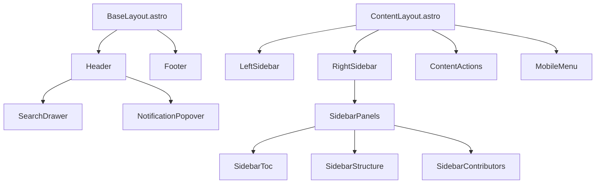

# src/components - UI 组件模块

> [根索引](../../CLAUDE.md) > components

---

## 模块概览

本目录包含所有 Astro UI 组件，负责页面的视觉呈现和交互功能。

## 组件清单

| 组件 | 功能 | 依赖 |
|------|------|------|
| `Header.astro` | 页面头部导航栏 | `navigation.ts`, `notifications.ts` |
| `Footer.astro` | 页面底部 | - |
| `LeftSidebar.astro` | 左侧章节导航 | `sidebars.ts` |
| `RightSidebar.astro` | 右侧目录 (TOC) | `toc.ts` |
| `SearchDrawer.astro` | 搜索抽屉 (Pagefind) | `search.ts` |
| `NotificationPopover.astro` | 通知 Popover | `notifications.ts` |
| `MobileMenu.astro` | 移动端菜单 | - |
| `ContentActions.astro` | 内容操作栏 (编辑/分享) | - |
| `ContentTabSwitcher.astro` | 多标签内容切换栏 | `tabContent.ts` |
| `SidebarPanels.astro` | 侧栏面板切换容器 | - |
| `SidebarStructure.astro` | 文档结构视图 | - |
| `SidebarToc.astro` | 目录视图 | - |
| `SidebarContributors.astro` | 贡献者视图 | `site.ts` |
| `BackToTop.astro` | 返回顶部按钮 | - |

## 组件依赖关系

## 关键组件说明

### SearchDrawer.astro
搜索功能入口，集成 Pagefind 搜索引擎。
- 通过 `data-pagefind-filter` 支持 `chapter:` 过滤
- 章节映射来自 `src/config/search.ts`

### NotificationPopover.astro
站点通知系统，显示可配置的通知列表。
- 点击 Header 铃铛图标显示/隐藏 Popover
- 通知配置来自 `src/config/notifications.ts`
- 支持 4 种通知类型：announcement, info, warning, success
- 通知可设置标题、内容、日期和可选链接
- 居中显示，支持点击外部和 ESC 键关闭

### LeftSidebar.astro
左侧导航栏，根据当前路由动态渲染对应章节的侧栏。
- 调用 `getSidebarForPath()` 获取侧栏配置

### RightSidebar.astro
右侧目录栏，包含三个面板：
1. 目录 (TOC) - 当前页面标题导航
2. 结构 - 文档结构树
3. 贡献者 - 页面贡献者信息

### ContentTabSwitcher.astro
GitHub 风格的多标签内容切换组件（全章节通用）。
- 当目录下存在 2+ 个 .md 文件时自动显示标签栏
- 支持键盘导航 (ArrowLeft/Right, Home/End)
- 通过 `tab:` frontmatter 配置标签名称和排序
- 由 `TabContentLayout.astro` 在任意章节调用

## 修改指南

1. 新增组件请保持 PascalCase 命名
2. 组件若依赖配置，需在本文档更新依赖关系
3. 涉及搜索/导航的改动需同步 `src/config/` 配置
