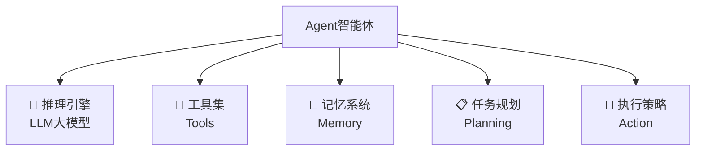

# 🤖 Agent（智能体）

## 📖 什么是Agent

**Agent（智能体）**是具有自主性、目标导向性和环境适应性的AI系统。它不仅能理解和生成文本，还能主动采取行动、使用工具、保持记忆，并在复杂环境中完成任务。

### 核心组成



---

## 🏗️ Agent架构演进

### 1️⃣ 第一代：ReAct模式（2023初）

```
思考(Reasoning) → 行动(Acting) → 观察(Observation) → 循环
```

**代表**：LangChain Agent、AutoGPT
**特点**：简单循环，容易陷入死循环

### 2️⃣ 第二代：规划驱动（2023中）

```
任务分解 → 子任务规划 → 并行执行 → 结果整合
```

**代表**：BabyAGI、GPT-4 Plugins
**特点**：引入任务规划，但灵活性不足

### 3️⃣ 第三代：多智能体协作（2024）

```
专业化分工 → 智能体间通信 → 协同决策 → 集成输出
```

**代表**：AutoGen、CrewAI、MetaGPT
**特点**：模拟团队协作，处理复杂任务

### 4️⃣ 第四代：自适应进化（2025）

```
环境感知 → 策略学习 → 自我优化 → 持续进化
```

**代表**：Claude Computer Use、OpenAI Swarm
**特点**：具备学习能力，可自我改进

---

## 💡 Agent核心能力

### 1. 工具使用 🔧

```python
# Agent可以调用的工具示例
tools = [
    "网络搜索",      # 获取实时信息
    "代码执行",      # 运行Python/JS代码
    "文件操作",      # 读写文件
    "API调用",       # 与外部服务交互
    "数据库查询",    # 结构化数据访问
    "图像识别",      # 多模态理解
    "命令行执行"     # 系统级操作
]
```

### 2. 记忆管理 💾

- **短期记忆**：当前对话上下文
- **长期记忆**：跨会话的知识积累
- **情景记忆**：特定场景的经验
- **程序记忆**：学会的技能和流程

### 3. 任务规划 📋

```yaml
复杂任务: '帮我分析公司上季度的销售数据并生成报告'
Agent分解: 1. 获取数据源
  2. 数据清洗和预处理
  3. 统计分析
  4. 可视化图表生成
  5. 报告撰写
  6. 格式优化和输出
```

### 4. 自主决策 🎯

- 判断何时需要更多信息
- 选择最合适的工具
- 处理错误和异常
- 优化执行路径

---

## 🚀 应用场景

### 办公自动化

- **邮件助手**：自动分类、回复、跟进
- **文档处理**：生成、审阅、格式转换
- **日程管理**：会议安排、提醒、冲突处理
- **数据分析**：报表生成、趋势分析、异常检测

### 软件开发

- **代码助手**：需求分析→设计→编码→测试
- **DevOps**：CI/CD流程自动化
- **问题诊断**：日志分析、性能优化
- **文档维护**：API文档、README更新

### 客户服务

- **智能客服**：多轮对话、问题解决
- **工单处理**：分类、分配、跟踪
- **知识库维护**：FAQ更新、案例总结
- **情感分析**：客户满意度监测

### 研究分析

- **文献调研**：论文检索、总结、引用
- **数据科学**：实验设计、结果分析
- **市场研究**：竞品分析、趋势预测
- **投资分析**：财报解读、风险评估

---

## 🛠️ 开发框架对比

| 框架          | 特点               | 适用场景           | 学习曲线 |
| ------------- | ------------------ | ------------------ | -------- |
| **LangChain** | 功能最全，生态完善 | 复杂应用，企业级   | 陡峭     |
| **AutoGen**   | 多Agent协作专精    | 团队模拟，复杂任务 | 中等     |
| **CrewAI**    | 简单直观，易上手   | 中小型项目         | 平缓     |
| **Dify**      | 可视化搭建         | 非技术用户         | 简单     |
| **Flowise**   | 低代码流程编排     | 快速原型           | 简单     |
| **MetaGPT**   | 软件开发专用       | 代码生成项目       | 中等     |

---

## ⚙️ 实践建议

### 1. 从简单开始

```python
# 最小可行Agent
class SimpleAgent:
    def __init__(self, llm, tools):
        self.llm = llm
        self.tools = tools
        self.memory = []

    def run(self, task):
        # 1. 理解任务
        plan = self.llm.plan(task)
        # 2. 执行动作
        for action in plan:
            result = self.tools[action].execute()
            self.memory.append(result)
        # 3. 总结输出
        return self.llm.summarize(self.memory)
```

### 2. 逐步增强能力

- **第一步**：单一工具调用（如搜索）
- **第二步**：多工具组合（搜索+总结）
- **第三步**：加入记忆（历史上下文）
- **第四步**：任务分解（复杂任务）
- **第五步**：多Agent协作（团队模式）

### 3. 注意事项

- **明确边界**：Agent能做什么，不能做什么
- **错误处理**：失败时的降级策略
- **成本控制**：Token消耗、API调用限制
- **安全防护**：防止恶意指令、数据泄露
- **性能优化**：缓存、并发、超时控制

---

## 📊 发展趋势（2025）

### 技术突破

- **原生Agent模型**：专门为Agent设计的基础模型
- **端到端优化**：从感知到执行的全链路优化
- **跨模态协作**：文本、视觉、语音统一处理
- **实时学习**：在线学习和适应能力

### 应用创新

- **个人AI助理**：7×24小时的生活工作助手
- **企业智能体**：部门级、公司级的AI员工
- **行业专家**：垂直领域的专业Agent
- **协作网络**：Agent之间的市场和生态

### 挑战与机遇

- **可靠性**：如何保证Agent的稳定性
- **可解释**：Agent决策的透明度
- **可控性**：人类如何保持控制权
- **伦理问题**：Agent的责任和边界

---

## 🎯 快速上手资源

### 入门教程

- [LangChain Agent入门](https://python.langchain.com/docs/tutorials/agents/) - 官方教程
- [AutoGen多Agent教程](https://microsoft.github.io/autogen/) - 微软出品
- [Building AI Agents](https://www.deeplearning.ai/short-courses/building-agentic-rag-with-llamaindex/) - 吴恩达课程

### 开源项目

- [GPT Researcher](https://github.com/assafelovic/gpt-researcher) - 自主研究Agent
- [DevOpsGPT](https://github.com/kuafuai/DevOpsGPT) - 开发运维Agent
- [AgentGPT](https://github.com/reworkd/AgentGPT) - 浏览器中的Agent

### 商业产品

- **Adept ACT-1** - 通用计算机控制
- **Cognition Devin** - AI软件工程师
- **Perplexity** - 搜索Agent
- **Julius AI** - 数据分析Agent

---

## 💭 未来展望

Agent不仅是工具的升级，更代表着人机协作的新范式：

- **从助手到同事**：Agent将成为真正的工作伙伴
- **从执行到创造**：具备创新和解决未知问题的能力
- **从个体到群体**：Agent社会的形成和演化
- **从工具到伙伴**：建立信任和长期协作关系

> 🌟 **核心洞察**：Agent的本质是让AI从"回答问题"进化到"解决问题"。掌握Agent技术，就是掌握AI时代的生产力工具。
