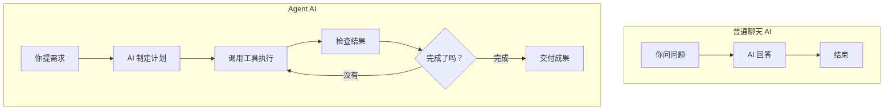
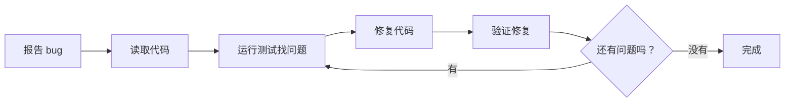
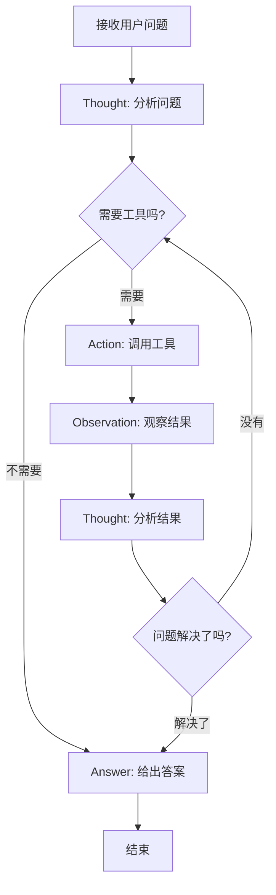

## 为什么需要 Agent

你有没有遇到过这种情况：跟 AI 聊天时，它只能回答问题，但不能帮你真正**做事**？

比如你问："帮我分析一下这个项目的代码问题"，普通 AI 只能给你一些建议，但 Agent 可以直接：
- 读取你的代码文件
- 分析每个文件的问题
- 生成详细的报告
- 甚至直接修复部分问题

这就是 Agent 存在的意义：**从聊天工具变成真正的工作助手**。

## Agent vs 普通聊天



### 关键区别

| 对比 | 普通聊天 | Agent |
|------|---------|--------|
| **能力** | 只能聊天 | 能干活 |
| **交互** | 一问一答 | 主动执行任务 |
| **工具** | 无法使用外部工具 | 可以调用各种工具 |
| **结果** | 文字回复 | 实际成果 |

## 你每天都在用的 Agent

### 1. Cursor 编程助手
Cursor 里的 AI 不只是回答编程问题，它能：
- **读取整个项目代码**，理解你的项目结构
- **直接在编辑器中写代码**，而不是让你复制粘贴
- **运行测试**，检查代码是否有问题
- **自动重构**，优化你的代码

### 2. GitHub Copilot
Copilot 作为代码助手：
- **实时分析你正在写的代码**
- **根据上下文智能补全**
- **理解你的意图**，而不是简单的文本匹配

### 3. Claude Code (就是现在这个)
你现在用的 Claude Code 就是一个 Agent：
- **读取你的文件**
- **执行命令**
- **修改代码**
- **运行测试**

### 4. 日常工具中的 Agent
- **智能客服**：不只回答问题，还能帮你退货、改地址
- **智能音箱**：不只播音乐，还能控制家电、下单购物
- **导航 App**：不只查路线，还能实时避开拥堵、订外卖

## Agent 的核心能力

### 能调用工具
普通 AI：`"你可以用 git commit 命令提交代码"`
Agent AI：直接执行 `git add . && git commit -m "fix bugs"`

### 能读取信息
普通 AI：`"请把你的错误日志发给我看看"`
Agent AI：直接读取 log 文件，分析问题

### 能持续工作
普通 AI：一轮对话结束就忘记了
Agent AI：记住之前的工作，继续完成复杂任务

## 工作流程对比

### 普通聊天解决 bug
```
你：代码有 bug，怎么办？
AI：你可以这样检查...
你：检查了，发现是 XX 问题
AI：那你可以这样修复...
你：修复了，但还有其他问题
AI：再检查一下...
```

### Agent 解决 bug


## Agent 的限制

### 需要权限控制
Agent 能力越强，风险越大：
- 只给它必要的权限
- 重要操作需要你确认
- 保留操作日志

### 成本更高
Agent 需要：
- 更多的 API 调用
- 更复杂的推理过程
- 更多的计算资源

### 可能出错
Agent 自主决策，可能：
- 理解错你的意图
- 选择错误的工具
- 产生意外的副作用

## 未来趋势

Agent 正在变得越来越强大：
- **更多工具集成**：能操作更多软件和服务
- **更好的推理能力**：能处理更复杂的任务
- **更长的记忆**：能处理跨天、跨周的项目
- **多智能体协作**：多个专业 Agent 合作完成大项目

## 深度解析：ReAct Agent 的设计原理

为了让你更好理解 Agent 是如何工作的，我们来深度解析一个经典的 Agent 架构：**ReAct Agent**（Reasoning + Acting）。

### ReAct Agent 是什么

ReAct 是"推理 + 行动"的结合，它让 AI 像人一样：
1. **思考**问题 (Reasoning)
2. **采取行动** (Acting)
3. **观察结果** (Observation)
4. **继续思考**，直到解决问题

### 工作循环详解



### 真实工作案例

**用户问题**："帮我查一下北京今天的天气，然后推荐适合的穿衣建议"

**ReAct Agent 的执行过程**：

```
Thought: 用户想知道北京今天的天气和穿衣建议。我需要先查询天气信息。

Action: 调用天气API工具
Action Input: {"city": "北京", "date": "today"}

Observation: 今天北京多云，温度 15-22°C，湿度 60%，有小风

Thought: 已获得天气信息。现在我需要基于这个天气条件给出穿衣建议。

Action: 调用穿衣建议工具
Action Input: {"temperature": "15-22°C", "weather": "多云", "wind": "小风"}

Observation: 建议穿长袖T恤+薄外套，可携带小外套备用

Thought: 现在我有了完整的信息，可以给用户一个综合的回答。

Answer: 北京今天多云，温度15-22°C，建议穿长袖T恤配薄外套，由于有小风建议携带一件备用外套。天气较为舒适，适合外出活动。
```

### 核心技术组件

#### 1. 推理引擎 (Reasoning Engine)
```python
# 伪代码示例
class ReasoningEngine:
    def think(self, context, previous_observations):
        # 分析当前情况
        # 决定下一步行动
        return thought_process
```

#### 2. 工具调用器 (Tool Executor)
```python
class ToolExecutor:
    def __init__(self):
        self.tools = {
            "weather_api": WeatherAPI(),
            "search_engine": SearchTool(),
            "calculator": Calculator()
        }

    def execute(self, tool_name, parameters):
        return self.tools[tool_name].run(parameters)
```

#### 3. 观察分析器 (Observation Analyzer)
```python
class ObservationAnalyzer:
    def analyze(self, tool_result):
        # 解析工具返回结果
        # 判断是否需要继续
        return analysis_result
```

### 提示词设计

ReAct Agent 的关键在于精心设计的系统提示词：

```
你是一个能够进行推理和行动的智能助手。你将按照以下格式工作：

Thought: [分析当前情况，思考需要做什么]
Action: [选择要使用的工具]
Action Input: [工具的输入参数]
Observation: [工具返回的结果]

重复上述过程，直到你能给出最终答案：
Answer: [最终回答]

可用工具：
1. search_tool: 搜索网络信息
2. calculator: 进行数学计算
3. weather_api: 查询天气信息

记住：
- 每次只能调用一个工具
- 必须先 Thought 再 Action
- 根据 Observation 调整策略
```

### 技术实现细节

#### 1. 模型选择
- **推理能力强的模型**：GPT-4、Claude 等
- **工具调用专用模型**：支持 Function Calling 的模型

#### 2. 解析机制
```python
def parse_agent_output(text):
    # 解析 AI 输出，提取 Thought、Action、Answer
    if "Action:" in text:
        action = extract_action(text)
        return {"type": "action", "content": action}
    elif "Answer:" in text:
        answer = extract_answer(text)
        return {"type": "answer", "content": answer}
```

#### 3. 错误处理
- **工具调用失败**：重新思考，选择其他工具
- **循环次数限制**：防止无限循环
- **幻觉检测**：验证工具调用的合理性

### 优势与局限

#### 优势
- **透明度高**：每步推理过程可见
- **可调试性强**：容易找到问题环节
- **灵活性好**：可动态调整策略

#### 局限
- **推理成本高**：每步都需要 LLM 调用
- **延迟较大**：串行处理影响响应速度
- **依赖模型能力**：推理质量决定性能上限

### 在实际产品中的应用

#### GitHub Copilot Chat
```
Thought: 用户想重构这个函数，我需要先分析代码结构
Action: 分析代码
Observation: 发现函数过长，职责不清
Thought: 需要按功能拆分
Action: 生成重构方案
```

#### Cursor Agent
```
Thought: 用户报告了一个 bug，我需要先定位问题
Action: 读取错误日志
Observation: 发现是空指针异常
Thought: 检查相关代码
Action: 分析代码逻辑
```

**总结：ReAct Agent 的核心在于"思考-行动-观察"的循环，让 AI 具备了类似人类的问题解决能力。**

---

**Agent 的核心价值：把 AI 从"聊天伙伴"变成"工作伙伴"。**

它不再只是回答你的问题，而是真正帮你把事情做完。
