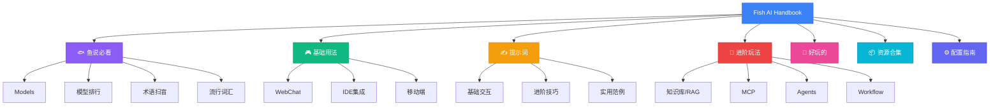

## 👋 欢迎来到 Fish AI Handbook

这不是一本教科书，而是一份**能用得上的实战手册**。  
无论你是第一次接触 AI，还是想深入了解最新工具，这里都有你需要的。

---

## 📚 手册结构一览

### 🐟 鱼说必看（你在这里）

**目的：** 扫盲 + 建立基础认知

- **[Models →](/fish-talks/models)** - 了解主流AI模型的特点与选择
- **[模型排行 →](/fish-talks/llm-rankings)** - 看看哪些模型在各方面表现最好
- **[术语扫盲 →](/fish-talks/glossary)** - 搞懂常见参数和概念，避免迷惑
  - [模型参数](/fish-talks/glossary/model-params) - Temperature、Top-P、Token等
  - [AI概念](/fish-talks/glossary/ai-concepts) - Context、Agent、MCP、RAG等
- **[流行词汇 →](/fish-talks/buzz)** - Agent、Vibe Coding等新词都是什么意思

### 🎮 基础用法

**目的：** 快速开始使用AI工具

- WebChat、IDE集成、移动端...各种使用方式全覆盖
- Cherry Studio、Claude Code等热门工具的使用指南

**[开始使用 →](/basic-usage)**

### ✍️ 提示词

**目的：** 学会“说人话”让AI理解你

- 从基础到进阶，学会写出高质量的提示词
- 实用技巧和常见范例

**[学习提示词 →](/prompts)**

### 🚀 进阶玩法

**目的：** 构建自己的AI应用

- 知识库（RAG 原理与实践）、MCP、Agents、Workflow
- 技术原理、工具选型、实战案例

**[探索进阶 →](/advanced)**

### 🎨 好玩的

**目的：** 探索AI的创意可能

- AI绘画、模型解锁、有趣的项目

**[去玩玩 →](/fun)**

### 📦 资源合集

**目的：** 找到好用的工具和服务

- API密钥、代理节点、云平台推荐

**[查看资源 →](/resources)**

### ⚙️ 配置指南

**目的：** 环境配置与工具安装

- 从零开始配置开发环境

**[配置环境 →](/setup)**

---

## 🎯 快速导航（按需求）

**我想立刻开始用AI：**  
→ 先看 [基础用法](/basic-usage)，选一个顺手的工具

**我想写好提示词：**  
→ 直接跳到 [提示词](/prompts) 章节

**我想了解技术原理：**  
→ 从 [术语扫盲](/fish-talks/glossary) 开始，再看 [进阶玩法](/advanced)

**我想搭建AI应用：**  
→ 看 [进阶玩法](/advanced) + [配置指南](/setup)

**我就是好奇：**  
→ 随便逛逛 [好玩的](/fun)

---

## 💡 使用建议

**新手：** 按顺序看“鱼说必看”→“基础用法”→“提示词”

**有经验：** 直接跳到“进阶玩法”或“资源合集”

**遇到问题：** 先查“术语扫盲”，再去对应章节找答案

---

## 🔍 本章内容（鱼说必看）

下面的几个页面帮你建立AI相关的基础认知：

- **[Models →](/fish-talks/models)** - 认识主流AI模型
- **[模型排行 →](/fish-talks/llm-rankings)** - 对比模型性能
- **[术语扫盲 →](/fish-talks/glossary)** - 搞懂关键概念
- **[流行词汇 →](/fish-talks/buzz)** - 了解AI圈黑话

准备好了吗？让我们开始吧！ 🚀
