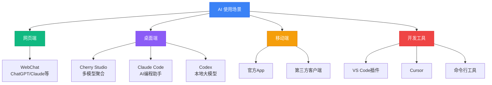

本页聚焦"使用"而非"配置"。对应工具的安装与环境配置请前往"配置指南（/setup/\*）"。

## AI 工具使用场景概览

推荐阅读顺序：

- WebChat：/basic-usage/webchat
- AI IDE：/basic-usage/editor-agent
- Mobile：/basic-usage/mobile-apps
- Cherry Studio（使用向）：/basic-usage/cherrystudio
- Claude Code（使用向）：/basic-usage/claude-code
- Codex（使用向）：/basic-usage/codex
- Others：/basic-usage/others
