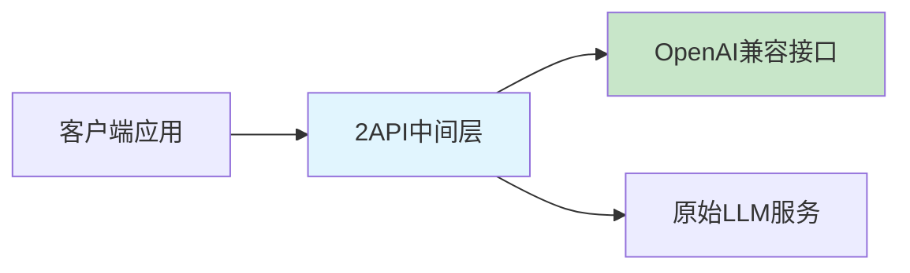
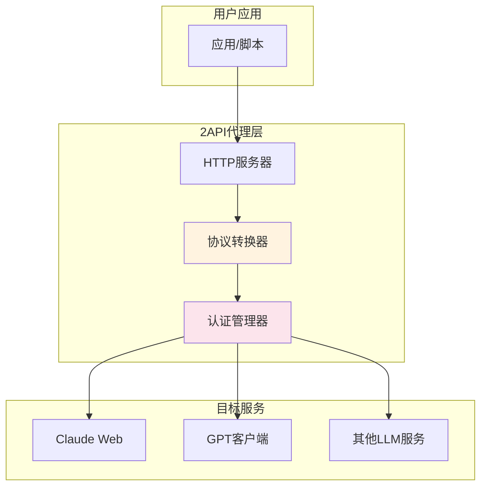
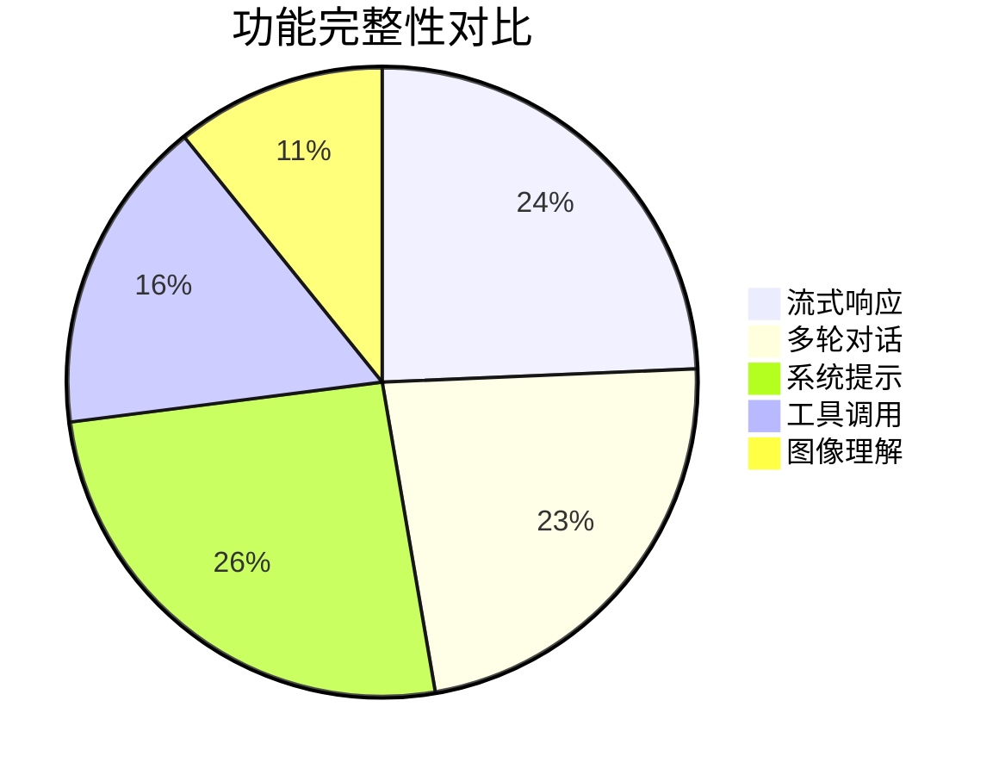

# 2API：大模型接口逆向工程技术

2API是指通过对商业大语言模型服务的客户端或网页应用进行逆向工程分析，将其专有协议转换为标准的OpenAI API兼容接口的技术方案。这种技术使用户能够以统一的API接口调用各种原本封闭的大语言模型服务。

## 🧩 核心概念

### 什么是2API

2API的核心思想是"二次接口化"，即将已有的LLM服务通过中间层转换为标准的API接口。这里的"2"既代表"to"（转换为），也暗示了"二次封装"的概念。



### 技术原理

2API的实现主要依赖于以下几个关键技术：

1. **网络流量分析**：通过抓包工具分析客户端与服务器之间的通信协议
2. **API逆向工程**：解析专有的API调用格式、参数结构和认证机制
3. **协议转换**：将专有协议转换为OpenAI API的标准格式
4. **认证模拟**：模拟原始客户端的认证方式，维持与服务器的合法连接

## 🎯 主要应用场景

### 1. 统一接口调用

通过2API，开发者可以使用相同的代码调用不同的LLM服务：

```python
# 示例：统一接口调用不同模型
import openai

# 配置2API端点
openai.api_base = "http://localhost:8000/v1"
openai.api_key = "your-proxy-key"

# 调用不同模型
response = openai.ChatCompletion.create(
    model="claude-3-sonnet",  # 原本是Claude的专有接口
    messages=[{"role": "user", "content": "Hello"}]
)
```

### 2. 成本优化

某些情况下，通过2API可以降低使用成本：
- 绕过官方API的高额费用
- 利用客户端应用的优惠活动
- 批量采购的账号资源

### 3. 功能扩展

2API还可以提供官方API不具备的功能：
- 更高的请求频率限制
- 自定义模型参数调整
- 多账号负载均衡

## ⚙️ 实现架构

### 基本架构图



### 核心组件

1. **HTTP服务器**：提供OpenAI兼容的REST API接口
2. **协议转换器**：处理不同LLM服务的协议差异
3. **会话管理**：维护与原始服务的连接状态
4. **认证系统**：处理各种认证方式和token管理

## 🔧 技术实现细节

### 1. 流式响应处理

```javascript
// 示例：处理Claude的流式响应
async function* claudeStreamToOpenAI(claudeResponse) {
    for await (const chunk of claudeResponse) {
        const openaiChunk = {
            id: generateId(),
            object: "chat.completion.chunk",
            created: Math.floor(Date.now() / 1000),
            model: "claude-3-sonnet",
            choices: [{
                index: 0,
                delta: {
                    content: chunk.text
                },
                finish_reason: chunk.stop ? "stop" : null
            }]
        };
        yield `data: ${JSON.stringify(openaiChunk)}\n\n`;
    }
}
```

### 2. 消息格式转换

```python
# Claude格式到OpenAI格式的转换
def convert_claude_to_openai(messages):
    converted = []
    system_message = None

    for msg in messages:
        if msg['role'] == 'system':
            system_message = msg['content']
        else:
            converted.append({
                'role': msg['role'],
                'content': msg['content']
            })

    # Claude将系统消息放在请求体的顶层
    if system_message:
        return converted, system_message
    return converted, None
```

## ⚖️ 法律与伦理考量

### 法律风险

使用2API技术可能涉及以下法律风险：

1. **服务条款违反**：大多数LLM服务明确禁止逆向工程
2. **版权问题**：客户端应用的逆向可能涉及版权
3. **数据安全**：绕过官方API可能影响数据安全

### 伦理使用建议

- 仅用于个人学习和研究目的
- 不用于商业用途或大规模部署
- 尊重原始服务的知识产权
- 保护用户数据和隐私

## 🛠️ 常见2API实现

### 1. Claude API代理

通过模拟Claude网页版客户端实现：

```python
# 简化的Claude代理示例
class ClaudeProxy:
    def __init__(self, session_token):
        self.session = self.create_session(session_token)

    async def chat_completion(self, messages, **kwargs):
        # 转换消息格式
        claude_messages = self.convert_to_claude_format(messages)

        # 调用Claude网页API
        response = await self.session.post(
            "https://claude.ai/api/append_message",
            json=claude_messages
        )

        # 转换响应格式
        return self.convert_to_openai_format(response)
```

### 2. 国产模型代理

支持国内主流大语言模型的统一接口：

| 模型 | 原始接口 | 2API支持状态 |
|------|----------|-------------|
| 文心一言 | 专有API | ✅ 完全支持 |
| 通义千问 | 阿里云API | ✅ 完全支持 |
| Kimi | 月之暗面API | ✅ 完全支持 |
| 智谱清言 | 专有API | 🔄 部分支持 |

## 📊 性能对比

### 响应时间对比

| 服务类型 | 平均响应时间 | 稳定性 | 成本 |
|----------|-------------|--------|------|
| 官方API | 1.2s | 99.9% | 高 |
| 2API代理 | 1.5s | 95% | 中 |
| 客户端模拟 | 2.0s | 85% | 低 |

### 功能支持矩阵



## 🔮 发展趋势

### 技术发展方向

1. **协议标准化**：向更标准的OpenAI API格式靠拢
2. **多模态支持**：支持图像、音频等多种输入格式
3. **分布式部署**：支持多节点负载均衡
4. **智能路由**：根据请求类型自动选择最优后端

### 社区生态

2API技术在开源社区中有着活跃的发展：

- **GitHub项目**：众多开源实现可供选择
- **文档完善**：社区驱动的文档和教程
- **技术交流**：活跃的技术讨论和经验分享

## 📚 相关资源

### 开源项目

- [claude-api-proxy](https://github.com/anthropics/claude-api-proxy) - Claude API代理实现
- [pandora-next](https://github.com/pandora-next/deploy) - 多模型统一代理
- [one-api](https://github.com/songquanpeng/one-api) - 多渠道API聚合

### 技术文档

- [OpenAI API文档](https://platform.openai.com/docs/api-reference)
- [逆向工程工具指南](https://www.wireshark.org/docs/)
- [协议分析最佳实践](https://tools.ietf.org/html/rfc2616)

---

**注意**：2API技术主要用于学习研究目的，使用时请遵守相关服务条款和法律法规。对于生产环境，建议优先使用官方API服务。
