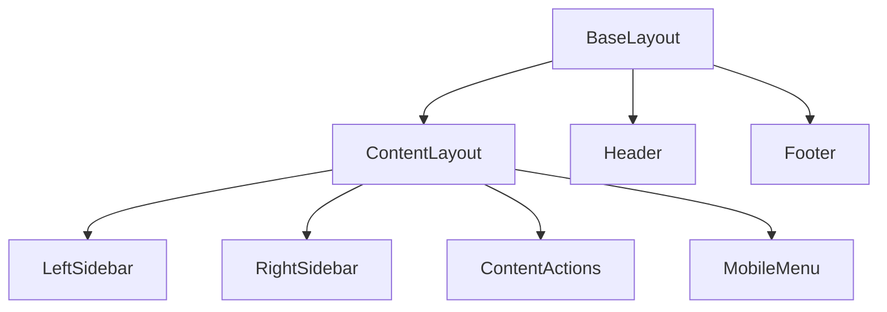

# src/layouts - 布局模块

> [根索引](../../CLAUDE.md) > layouts

---

## 模块概览

页面布局模板，定义页面的整体结构和通用元素。

## 文件清单

| 文件 | 功能 |
|------|------|
| `BaseLayout.astro` | 基础 HTML 结构、SEO meta、全局样式引入 |
| `ContentLayout.astro` | 文档页三栏布局 (左侧栏 + 内容 + 右侧栏) |
| `ResourcesContentLayout.astro` | 资源页布局 (支持多标签内容切换) |

## 布局层级

## BaseLayout.astro

基础布局，所有页面的根模板。

**职责**:
- HTML 文档结构 (`<html>`, `<head>`, `<body>`)
- SEO meta 标签 (title, description, og:*)
- 全局样式引入
- Header 和 Footer 组件

**Props**:
- `title`: 页面标题
- `description`: 页面描述
- `image?`: OG 图片
- `robots?`: robots meta

## ContentLayout.astro

文档内容页布局，继承自 BaseLayout。

**职责**:
- 三栏布局结构
- 内容渲染 (`<slot />`)
- 侧栏组件集成
- Pagefind 索引标记 (`data-pagefind-*`)

**Props**:
- 继承 BaseLayout 所有 props
- `entry`: Content Collection entry
- `headings`: 标题列表 (用于 TOC)

## ResourcesContentLayout.astro

资源章节专用布局，支持 GitHub 风格多标签内容切换。

**功能**:
- 自动检测同目录下的多个 .md 文件
- 渲染标签切换栏 (2+ 文件时显示)
- 单文件目录自动退化为普通页面
- **侧栏同步**: 标签切换时自动更新 TOC 和贡献者列表

**Props**:
- `basePath`: 内容路径 (e.g., `06-resources/api`)
- `title`: 页面标题
- `sidebarItems`: 侧栏配置

**客户端同步逻辑** (仅多标签时激活):
- 监听 `tab-changed` 事件
- 重建 TOC: 从当前可见 panel 提取标题
- 更新贡献者: 根据标签元数据动态渲染

**试点**: resources 章节，可扩展到其他章节

## 修改指南

1. 修改全局结构 → 编辑 `BaseLayout.astro`
2. 修改文档页结构 → 编辑 `ContentLayout.astro`
3. 修改多标签功能 → 编辑 `ResourcesContentLayout.astro`
4. 添加新布局 → 创建新 `.astro` 文件并继承 `BaseLayout`
