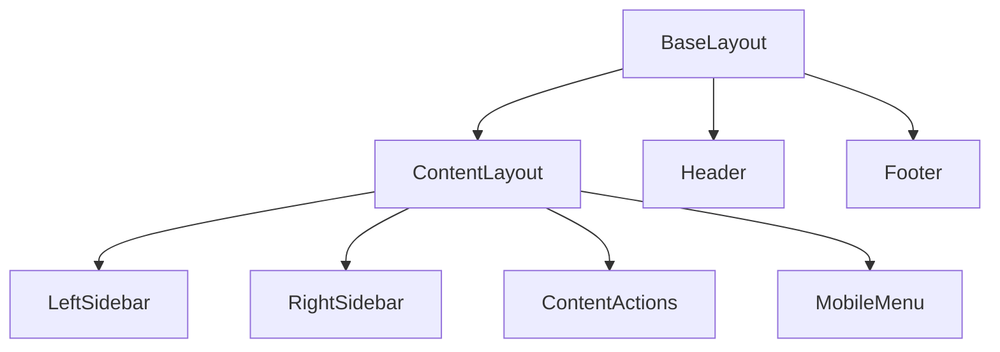

# src/layouts - 布局模块

> [根索引](../../CLAUDE.md) > layouts

---

## 模块概览

页面布局模板，定义页面的整体结构和通用元素。

## 文件清单

| 文件 | 功能 |
|------|------|
| `BaseLayout.astro` | 基础 HTML 结构、SEO meta、全局样式引入 |
| `ContentLayout.astro` | 文档页三栏布局 (左侧栏 + 内容 + 右侧栏) |

## 布局层级

## BaseLayout.astro

基础布局，所有页面的根模板。

**职责**:
- HTML 文档结构 (`<html>`, `<head>`, `<body>`)
- SEO meta 标签 (title, description, og:*)
- 全局样式引入
- Header 和 Footer 组件

**Props**:
- `title`: 页面标题
- `description`: 页面描述
- `image?`: OG 图片
- `robots?`: robots meta

## ContentLayout.astro

文档内容页布局，继承自 BaseLayout。

**职责**:
- 三栏布局结构
- 内容渲染 (`<slot />`)
- 侧栏组件集成
- Pagefind 索引标记 (`data-pagefind-*`)

**Props**:
- 继承 BaseLayout 所有 props
- `entry`: Content Collection entry
- `headings`: 标题列表 (用于 TOC)

## 修改指南

1. 修改全局结构 → 编辑 `BaseLayout.astro`
2. 修改文档页结构 → 编辑 `ContentLayout.astro`
3. 添加新布局 → 创建新 `.astro` 文件并继承 `BaseLayout`
